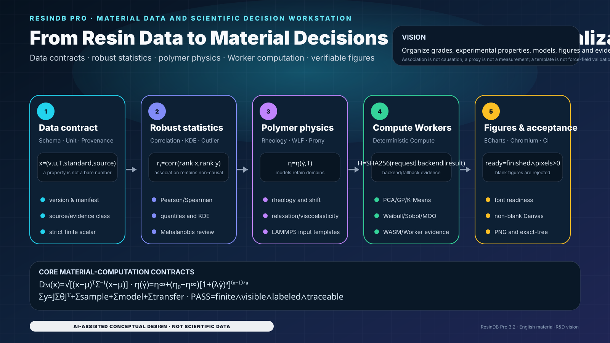

# ResinDB Pro by SunHJ — English Design Edition

[中文设计版](README.zh-CN.md) · [Complete bilingual technical documentation](README.md)

<!-- LOCALIZED_VISION_EN:START -->
## Project vision: from resin data to material decisions and scientific visualization

<p align="center">
  
</p>

> Every module and equation maps to current data, compute, Worker, ECharts and acceptance code. The figure is not resin test data, grade certification or force-field validation.

<!-- LOCALIZED_VISION_EN:END -->

## Positioning

ResinDB Pro joins resin grades, experimental/reference properties, statistical models, scientific-compute Workers, polymer-physics templates and reproducible acceptance in one evidence chain. It is not a certified LIMS, ERP, material-release system or validated force-field platform.

## Mathematical core

$$
D_M(\mathbf x)=\sqrt{(\mathbf x-oldsymbol\mu)^\mathsf T\Sigma^{-1}(\mathbf x-oldsymbol\mu)}
$$

$$
\eta(\dot\gamma)=\eta_\infty+(\eta_0-\eta_\infty)\left[1+(\lambda\dot\gamma)^a
ight]^{(n-1)/a}
$$

$$
\Sigma_ypprox J\Sigma_	heta J^\mathsf T+\Sigma_{sample}+\Sigma_{model}+\Sigma_{transfer}
$$

## Operating strategy

1. Validate Schema, units, standards, temperature, provenance and evidence class first.
2. Run statistics, fitting and material screening only on finite, dimensionally compatible data.
3. Keep observations, fits, proxies and scenario projections distinct.
4. Polymer/LAMMPS templates require external force-field, equilibration and experimental validation before supporting scientific conclusions.
5. Scientific figures must pass font readiness, ECharts completion, non-blank Canvas and PNG evidence gates.

## Acceptance

```bash
npm ci
npm run validate:docs
npm run validate:i18n-visuals
npm run validate:scientific-ui
npm run typecheck
npm run test:unit
npm run build
npm run test:ui
```
