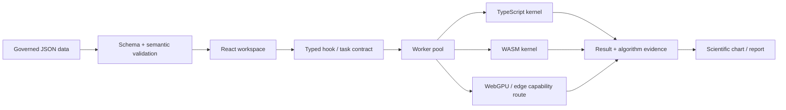

# ResinDB Pro by SunHJ

<p align="center">
  <a href="https://github.com/SUNHAOJUN22/ResinDB-Pro-by-SunHJ/actions/workflows/ci.yml"></a>
  
  
  
  
  
</p>

> **version-3.2.0-governed-data-scientific-compute**
> 面向合成树脂、聚合物牌号、实验数据、科学计算与科研绘图的浏览器端材料信息平台。

ResinDB Pro 不是单纯的牌号表，也不是只负责“画几张图”的前端页面。它将以下能力放在同一套可审计工作流中：

- **独立治理的树脂数据库**；
- **科研与工程数值计算**；
- **Web Worker / TypeScript / WASM 后端调度**；
- **牌号筛选、对比、关联、可靠性、流变和优化分析**；
- **真实浏览器证据、覆盖率、构建预算和依赖审计**。

> [!IMPORTANT]
> 本项目是科研与工程分析工具，不是经认证的 LIMS、ERP、法规判定或质量放行系统。演示数据、统计模型、外推结果和 AI 辅助内容必须回到原始测试报告、标准方法和专业判断中复核。

---

## 1. 平台定位

| 能力层 | ResinDB Pro 的实现 | 质量边界 |
|---|---|---|
| 数据层 | 独立 `data/` 目录、版本信封、Schema、manifest、SHA-256 | 数据不隐藏在 React bundle 中 |
| 计算层 | 26 个 Worker/计算模块、TypeScript 内核、WASM 策略、后端证据 | 非有限值和不满足条件的输入必须显式失败 |
| 科研图表 | 相关矩阵、KDE、Weibull、WLF、Copula、Arrhenius、Prony、Pareto 等 | 观测、拟合、代理和情景投影必须区分 |
| 工作区 | IndexedDB、本地历史、筛选、对比、导入导出 | 本地存储不等于经过服务器治理的数据库 |
| 验证层 | 单元/科学/Worker/Chromium/覆盖率/依赖审计 | 不允许用跳过测试换取“通过” |

---

## 2. 真实界面证据

本 README 不再堆叠 22 张同质化 AI 示意图，只保留 **8 张由完整 Chromium CI 生成的真实界面截图**。

### 2.1 中文材料数据工作区


### 2.2 英文暗色工作区


### 2.3 牌号详情、属性、来源与工程信息


### 2.4 科研分析与绘图工作区


### 2.5 流变代理与拟合边界


### 2.6 公式依赖与局部扰动灵敏度


### 2.7 K-Means 后端配置与审计


### 2.8 当前设备的 K-Means 校准证据


---

## 3. 数据库：数据层与代码层分离

### 3.1 为什么必须分离

数据库内容不能因为修改组件、图表或计算函数而被隐式改写。因此 ResinDB Pro 规定：

- `data/` 是权威数据层；
- `src/` 是代码层；
- `dist/data/` 是构建时复制的运行资产；
- 任何数据字节变化都必须更新 manifest 和 SHA-256；
- `demo`、`reference`、`measured`、`imported` 不能混为一种证据等级。

### 3.2 标准保存格式

权威保存格式为 **UTF-8 JSON + 版本化数据信封**：

```json
{
  "schemaVersion": "1.0.0",
  "dataKind": "resin-seed-products",
  "sourceType": "curated-demo",
  "recordStatus": "demo",
  "updatedAt": "2026-08-02",
  "data": []
}
```

六个顶层字段是固定合同，未知字段会被 Schema 和 CI 拒绝。

| 字段 | 含义 |
|---|---|
| `schemaVersion` | 数据结构兼容版本 |
| `dataKind` | 数据集稳定语义标识 |
| `sourceType` | 数据来源类型 |
| `recordStatus` | demo / reference / measured / imported |
| `updatedAt` | 真实 ISO 日期 |
| `data` | 数据负载 |

### 3.3 数据目录

```text
data/
├── manifest.json
├── metadata.json
├── version.json
├── schemas/
│   ├── resin-data-document.schema.json
│   └── resin-product.schema.json
└── resins/
    ├── manifest.json
    ├── polymerDatabase.json
    ├── myLabUniverse.json
    ├── openMarketUniverse.json
    ├── resin-taxonomy.json
    ├── resin-category-aliases.json
    ├── resin-property-groups.json
    ├── resin-manufacturers.json
    ├── resin-references.json
    └── resin-network.json
```

详细合同见 [`docs/DATA_ARCHITECTURE.md`](docs/DATA_ARCHITECTURE.md)。

### 3.4 属性不是“裸数字”

一个材料属性可以同时保存值、单位、标准、温度、仪器、来源和统计信息：

```json
{
  "value": 23.5,
  "unit": "MPa",
  "standard": "ISO 527",
  "temperature": 23,
  "instrument": "Universal testing machine",
  "referenceId": "ref-001",
  "mean": 23.5,
  "stdDev": 0.4,
  "count": 5
}
```

当前标准标量类型为 **字符串或有限数值**。Boolean、`NaN`、`Infinity` 和错误日期会被拒绝，防止数据虽然“加载成功”却无法参与计算或显示。

---

## 4. 计算架构



计算结果不仅包含数值，还可包含：

- task ID；
- kernel 和算法版本；
- 请求后端与实际后端；
- 精度；
- 输入形状；
- 耗时；
- fallback 状态；
- 设备能力快照；
- 可审计元数据。

26 个 Worker/计算模块的输入、输出、公式、显示入口和科学边界见：

[`docs/compute-module-catalog.json`](docs/compute-module-catalog.json)

---

## 5. 数理程式与代表性公式

### 5.1 线性最小二乘

$$
\min_{\boldsymbol{x}}\|\mathbf{A}\boldsymbol{x}-\boldsymbol{b}\|_2^2
$$

系统提供 Householder QR，并在秩亏或病态情况下使用 Jacobi-SVD 伪逆回退，同时输出秩、条件数、奇异值和残差范数。

### 5.2 有界非线性最小二乘

$$
\min_{\boldsymbol{\theta}}\frac{1}{2}\|\boldsymbol{r}(\boldsymbol{\theta})\|_2^2
$$

阻尼更新形式：

$$
(\mathbf{J}^{\mathsf T}\mathbf{J}+\lambda\mathbf{I})\Delta\boldsymbol{\theta}
=-\mathbf{J}^{\mathsf T}\boldsymbol{r}
$$

支持解析 Jacobian，保留中心差分兼容回退，并对有界参数变换实施链式法则。

### 5.3 Carreau–Yasuda 流变模型

$$
\eta(\dot\gamma)=\eta_0
\left[1+(\lambda\dot\gamma)^a\right]^{(n-1)/a}
$$

用于剪切变稀流变拟合；当前求解器要求至少 5 个正有限观测值。

### 5.4 WLF 时温等效

$$
\log_{10}a_T=-\frac{C_1(T-T_r)}{C_2+(T-T_r)}
$$

当前合同是水平移动模型，不把未建模的垂直移动伪装成已拟合参数。

### 5.5 Arrhenius 热老化

$$
k=A\exp\left(-\frac{E_a}{RT}\right)
$$

寿命线性化可写为：

$$
\ln t=C+\frac{E_a}{RT}
$$

输出属于 Arrhenius 假设下的外推，不等于实测服役寿命。

### 5.6 Kissinger 动力学

$$
\ln\left(\frac{\beta}{T_p^2}\right)
=C-\frac{E_a}{RT_p}
$$

要求至少 3 组有效升温速率与峰温数据。

### 5.7 Weibull 可靠性

$$
F(x)=1-\exp\left[-\left(\frac{x}{\eta}\right)^\beta\right]
$$

当前采用 Bernard 中位秩和二参数线性化估计，不把结果标成最大似然 MLE。

### 5.8 Spearman 等级相关

$$
\rho_s=\operatorname{corr}(R_x,R_y)
$$

其中并列观测采用平均秩。常量特征的相关性按既有合同返回 0，并明确标记为不可定义，而不是错误返回 1。

### 5.9 Gaussian Copula

令

$$
u_i=\frac{R_i-0.5}{n},\qquad z_i=\Phi^{-1}(u_i)
$$

然后以 normal-score 相关系数构造 Gaussian Copula 密度：

$$
c(u,v;\rho)=\frac{1}{\sqrt{1-\rho^2}}
\exp\left[
-\frac{\rho^2(z_u^2+z_v^2)-2\rho z_u z_v}
{2(1-\rho^2)}
\right]
$$

这是相依结构模型，不是因果机制证明。

### 5.10 Gaussian KDE

一维精确直接估计：

$$
\hat f(x)=\frac{1}{nh\sqrt{2\pi}}
\sum_{i=1}^{n}
\exp\left[-\frac{(x-x_i)^2}{2h^2}\right]
$$

二维产品核：

$$
\hat f(x,y)=\frac{1}{nh_xh_y}
\sum_{i=1}^{n}
K\left(\frac{x-x_i}{h_x}\right)
K\left(\frac{y-y_i}{h_y}\right)
$$

### 5.11 Mahalanobis 距离

$$
D_M^2=(\boldsymbol{x}-\boldsymbol{\mu})^{\mathsf T}
\mathbf{S}^{-1}
(\boldsymbol{x}-\boldsymbol{\mu})
$$

实现使用正则化协方差与 Cholesky 求解，避免为每个样本显式求逆。

### 5.12 Gaussian Process

$$
f(\boldsymbol{x})\sim\mathcal{GP}
\left(m(\boldsymbol{x}),k(\boldsymbol{x},\boldsymbol{x}')\right)
$$

RBF 核：

$$
k(\boldsymbol{x},\boldsymbol{x}')=
\exp\left(-\frac{\|\boldsymbol{x}-\boldsymbol{x}'\|^2}{2\ell^2}\right)
$$

用于 Bayesian 逆向推荐与多目标候选生成，结果是待验证候选，不是实验事实。

### 5.13 Bayesian Expected Improvement

$$
EI(\boldsymbol{x})=(\mu-f^*)\Phi(z)+\sigma\phi(z),
\qquad
z=\frac{\mu-f^*}{\sigma}
$$

### 5.14 Pareto 多目标优化

若不存在另一个可行点在所有目标上不差且至少一个目标严格更优，则该点为非支配点。

$$
\nexists\boldsymbol{x}' :
 f_i(\boldsymbol{x}')\preceq f_i(\boldsymbol{x})\;\forall i,
\quad
\exists j:f_j(\boldsymbol{x}')\prec f_j(\boldsymbol{x})
$$

### 5.15 Prony 黏弹性级数

$$
E(t)=E_\infty+
\sum_{i=1}^{N}E_i\exp\left(-\frac{t}{\tau_i}\right)
$$

采用非负/正则化求解，输出松弛时间、系数和残差诊断。

### 5.16 SPC 过程能力

$$
C_p=\frac{USL-LSL}{6\sigma}
$$

$$
C_{pk}=\min\left(
\frac{USL-\mu}{3\sigma},
\frac{\mu-LSL}{3\sigma}
\right)
$$

### 5.17 K-Means

$$
\min_{\{c_i\},\{\boldsymbol{\mu}_k\}}
\sum_{i=1}^{n}
\|\boldsymbol{x}_i-\boldsymbol{\mu}_{c_i}\|_2^2
$$

平台会记录 TypeScript/WASM 后端选择、设备校准、数值等价和实际运行证据。

### 5.18 覆盖率约束的直接牌号推荐

对目标牌号与候选牌号的共同有效属性执行全库 min-max 归一化，并计算 RMS 距离：

$$
d_{ab}=\sqrt{\frac{1}{|F_a\cap F_b|}
\sum_{j\in F_a\cap F_b}
(\tilde{x}_{aj}-\tilde{x}_{bj})^2}
$$

最终分数同时惩罚属性覆盖不足：

$$
S_{ab}=100\times\max(0,1-d_{ab})\times
\frac{|F_a\cap F_b|}{|F_a|}
$$

详情页会同时显示分数和共享维度数量；雷达图使用全局 0–100 归一化轴，不再把不同物理单位的原始数值混在同一半径尺度上。

### 5.19 相关系数显著性与斜率区间

Pearson 相关系数的检验统计量为：

$$
t=r\sqrt{\frac{n-2}{1-r^2}},\qquad \nu=n-2
$$

双侧显著性现在使用 Student-$t$ 分布的正则化不完全 Beta 表达，而不是把小样本统计量近似成标准正态分布。斜率的 95% 置信区间使用实际自由度对应的临界值：

$$
\hat\beta_1\pm t_{0.975,\,n-2}\operatorname{SE}(\hat\beta_1)
$$

Spearman 相关对并列数据使用平均秩；线性回归使用中心化在线协方差，降低大偏置坐标下的消减误差。

### 5.20 PP 两相密度筛选与聚合物输入边界

PP-like 密度结晶度筛选采用两相密度质量分数关系：

$$
X_c=\frac{\rho_c(\rho-\rho_a)}{\rho(\rho_c-\rho_a)}
$$

结果被明确标为经验筛选代理，而不是通用 QSPR 或实测结晶度。单体 SMILES 只在小型、显式支持的重复单元库内识别；系统不再由乙烯单体自动推断 HDPE 支化结构，也不再由丙烯单体自动推断等规度。未提供乙烯/丙烯/二烯组成的 EPDM 片段不会被压缩成伪重复单元或单一分子量。

LAMMPS 输出是需要独立拓扑和力场验证的起始模板。冷却起点、终点、步数、时间步长与 MSD 原子组均经过显式验证；自定义 MSD 组必须已在输入体系中定义。拉伸段冻结初始盒长，并将 `real` 单位制中的 $p_{xx}$ 从 atm 转换为 MPa：

$$
\sigma_x\,[\mathrm{MPa}]=-p_{xx}\,[\mathrm{atm}]\times 0.101325
$$

该模板不创建拓扑、交联或力场参数，不把快速 MD 冷却等同于实验冷却，也不把 MSD 单独解释为玻璃化转变温度。

---

## 6. 性能优化记录

已完成的性能审查包括：

| 热点 | 优化方式 | 保持不变的合同 |
|---|---|---|
| 非线性最小二乘 | 解析 Jacobian、工作缓冲区复用 | 目标函数与边界变换 |
| Carreau–Yasuda | 解析导数、对数和公共量预计算 | 四参数模型 |
| Gaussian Copula | 逆正态网格预计算、秩缓冲复用 | Copula 公式和网格 |
| Prony / Mahalanobis | 迭代和三角求解工作区复用 | 拟合与距离定义 |
| Gaussian Process | 预测对象、Cholesky 和 kernel scale 复用 | RBF GP 均值/方差 |
| Similarity network | 观测值样本方差、缺失掩码、重叠度惩罚与延迟边对象分配 | Z-score 余弦相似度 × 共享有效特征覆盖率 |
| Direct grade recommender | 稀疏单遍 min/max、目标特征缓存、覆盖率惩罚、稳定排序 | Min-max RMS 距离 × 目标属性覆盖率 |
| Radar percentile profiles | 每个维度只排序一次、二分查找中位秩 | 20–100 描述性显示尺度 |
| Statistical regression | 中心化在线协方差、Student-t/Beta 推断、临界值缓存 | 线性模型与 95% 区间定义 |
| Axis bounds | 单遍有限值扫描，线性轴保留负值 | 15% 轴边距合同 |
| Spearman | 平均秩索引复用、中心秩预计算 | 相关矩阵数值完全一致 |
| Monte Carlo KDE | 固定核因子外提 | 精确直接 KDE |

代表性验证中：

- 有界非线性拟合残差函数调用：`31 → 7`；
- Copula 逆正态调用在最大网格下：`39,800 → 199`；
- Spearman `8,000 × 24` 夹具：约 `70.6 ms → 38.2 ms`，矩阵最大差为 0；
- 直接 KDE `200,000 × 101` 夹具：约 `253.8 ms → 204.7 ms`，差异处于浮点重排量级；
- 直接牌号推荐稀疏 `10,000 × 120` 联合属性夹具：约 `397.94 ms → 11.46 ms`；稠密 `5,000 × 24` 夹具：约 `16.48 ms → 11.90 ms`；
- 雷达中位秩 `100,000` 个参考值、36 次显示查询夹具：约 `1,101.91 ms → 32.52 ms`，约 `33.9×`；
- 线性轴界限对 `1,000,000` 个有限值采用约 `8.38 ms` 的单遍扫描；旧 `Math.min(...array)` / `Math.max(...array)` 路径在该规模触发参数栈 `RangeError`。

时间结果是特定环境下的方向性证据，不承诺所有设备固定倍数。

---

## 7. 计算函数与显示链路门禁

`npm run validate:compute` 会永久检查：

1. 26 个 Worker 是否全部进入计算目录；
2. Worker 文件、hook 和显示入口是否存在；
3. 科学模块是否有直接测试引用；
4. 图表 ID 是否实际接入科研绘图工作区；
5. 输入、输出、公式和科学边界是否有文字合同；
6. `src/compute`、`src/workers`、`src/data` 是否残留显式 `any`；
7. 审计结果是否写入 `artifacts/compute-surface-audit.json`。

完整 A/B/C 级审查记录见：

[`docs/COMPUTE_AND_DISPLAY_AUDIT.md`](docs/COMPUTE_AND_DISPLAY_AUDIT.md)

第八轮材料统计与聚合物物理公式专项审计见：

[`docs/CODE_MATH_PERFORMANCE_AUDIT_2026-08-05_PASS8_MATERIAL_PHYSICS.md`](docs/CODE_MATH_PERFORMANCE_AUDIT_2026-08-05_PASS8_MATERIAL_PHYSICS.md)

---

## 8. 本地运行

### 环境

- Windows 10/11 或 Linux
- Node.js `>=22.12.0 <23`
- npm 10+
- Chromium-compatible browser（用于 UI smoke）

### 安装与开发

```bash
npm ci
npm run dev
```

### 生产构建

```bash
npm run build
npm run preview
```

---

## 9. 完整验证

```bash
npm run validate:data
npm run validate:docs
npm run validate:source
npm run validate:compute
npm run validate:scientific-ui
npm run lint
npm run typecheck
npm run test
npm run test:unit
npm run test:science
npm run test:coverage
npm run benchmark:kmeans:smoke
npm run build
npm run smoke
npm run test:ui
npm run audit:all
```

永久 CI 检查：

- 数据 Schema、manifest、字节数、SHA-256 和跨文件引用；
- 计算函数与显示链路目录；
- 科研图表科学边界；
- ESLint、TypeScript、回归和 Worker 测试；
- 全生产源码覆盖率；
- 构建预算和外置数据证明；
- HTTP 与 Chromium 真实交互；
- 生产依赖与完整依赖高危审计；
- 包含 `data/`、`docs/`、README、源码和测试的确定性 exact-tree 归档。

---

## 10. 安全与科学边界

- 浏览器 `VITE_*` 变量不是密钥存储方案；
- 生产密钥必须位于服务端网关；
- 相似度网络和直接牌号推荐均采用共享有效特征覆盖率惩罚，仍不等于化学等价或可互换性；
- 详情页雷达图是全局 min-max 归一化轮廓，0–100 不代表绝对性能百分比；
- 相关性和局部灵敏度不等于因果；
- 规则生成代理不等于实测数据；
- 情景带不等于置信区间；
- 外推结果不等于实际服役保证；
- AI 输出不得制造实验事实。

安全说明见 [`SECURITY.md`](SECURITY.md)。

---

## 11. 总结

ResinDB Pro 的核心不是“图多”，而是：

1. 数据以独立、版本化、可校验格式保存；
2. 数理程式具有明确输入、输出、公式和科学边界；
3. 计算在 Worker/后端体系中执行并产生证据；
4. 图表展示使用真实浏览器验证；
5. README、数据、代码和 CI 保持同一套可审计合同。

这使项目能够作为一个真正的 **树脂/聚合物材料数据库与科学计算工作站** 持续演进，而不是依赖静态演示图维持表面完整性。
