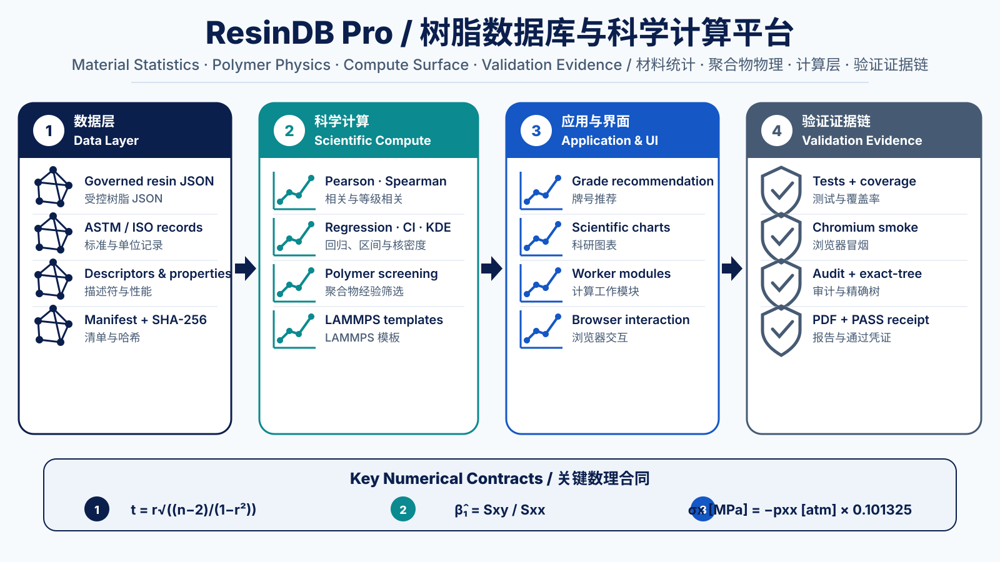
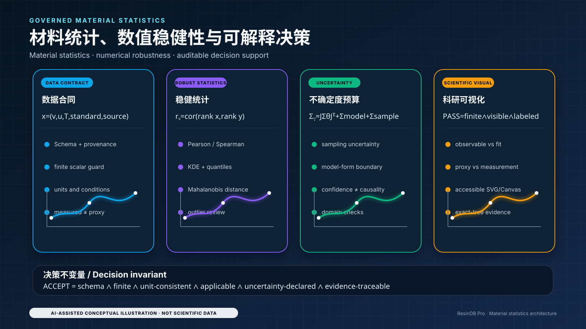
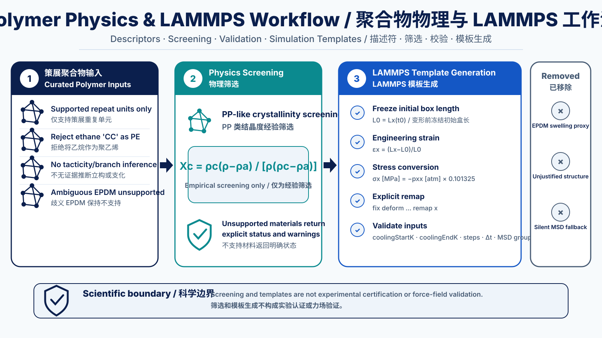
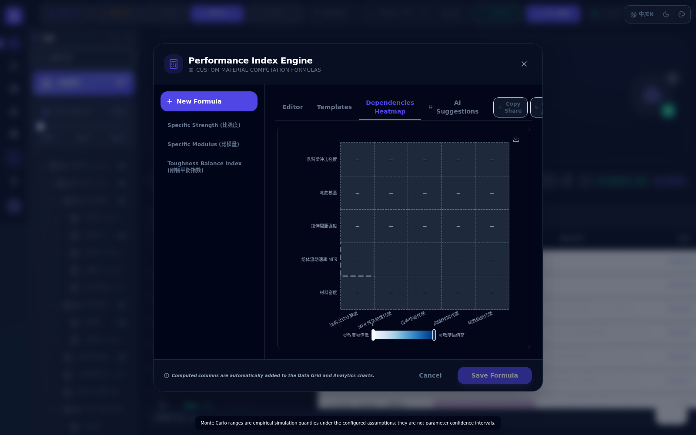
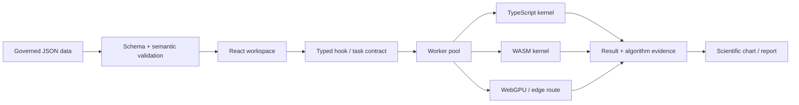

# ResinDB Pro by SunHJ

<p align="center">
  <a href="https://github.com/SUNHAOJUN22/ResinDB-Pro-by-SunHJ/actions/workflows/ci.yml"></a>
  
  
  
  
  
</p>

> **version-3.2.0-governed-data-scientific-compute**  
> 面向树脂与聚合物材料数据治理、统计分析、工程筛选、科学计算、科研绘图和可重复验收的浏览器端工作站。  
> *A browser-based workstation for governed resin and polymer data, statistical analysis, engineering screening, scientific computing, scientific visualization, and reproducible acceptance evidence.*



> [!IMPORTANT]
> 本项目提供统计关联、数值计算、工程筛选和仿真输入模板，不是经认证的 LIMS、ERP、法规判定、材料质量放行系统或已验证的力场平台。  
> *The project provides statistical association, numerical computation, engineering screening, and simulation-input templates. It is not a certified LIMS/ERP, regulatory decision engine, material-release system, or validated force-field platform.*

---

## 目录 / Table of contents

1. [平台定位 / Positioning](#1-平台定位--positioning)
2. [证据与示意图 / Evidence and diagrams](#2-证据与示意图--evidence-and-diagrams)
3. [数据架构 / Data architecture](#3-数据架构--data-architecture)
4. [计算架构 / Compute architecture](#4-计算架构--compute-architecture)
5. [数理程式 / Mathematical contracts](#5-数理程式--mathematical-contracts)
6. [聚合物物理与 LAMMPS / Polymer physics and LAMMPS](#6-聚合物物理与-lammps--polymer-physics-and-lammps)
7. [使用策略 / Usage strategy](#7-使用策略--usage-strategy)
8. [工作流示例 / Workflow examples](#8-工作流示例--workflow-examples)
9. [性能与稳健性 / Performance and robustness](#9-性能与稳健性--performance-and-robustness)
10. [验证与交付 / Validation and delivery](#10-验证与交付--validation-and-delivery)
11. [安全与科学边界 / Safety and scientific boundaries](#11-安全与科学边界--safety-and-scientific-boundaries)
12. [验收清单 / Acceptance checklist](#12-验收清单--acceptance-checklist)

---

## 1. 平台定位 / Positioning

ResinDB Pro 的核心不是“把数据放进表格”，而是把 **数据合同、计算合同、显示合同和验收证据** 放进同一条可审计链路。

*ResinDB Pro is not merely a table of resin grades. It joins data contracts, computation contracts, visualization contracts, and acceptance evidence into one auditable chain.*

| 能力层 / Layer | 实现 / Implementation | 交付边界 / Delivery boundary |
|---|---|---|
| 数据层 / Data | 独立 `data/`、JSON Schema、manifest、SHA-256、版本信封 | 数据不隐藏在 React bundle 中 / data are not hidden in the React bundle |
| 计算层 / Compute | 26 个 Worker/计算模块、TypeScript 内核、WASM 策略、后端证据 | 非有限值、越域输入和失败必须显式处理 |
| 统计层 / Statistics | Pearson、Spearman、回归、Student-t、KDE、分位数、异常值 | 关联不等于因果 / association is not causation |
| 聚合物物理 / Polymer physics | 策展重复单元、PP-like 密度筛选、LAMMPS 模板、ASTM/ISO 审查 | 筛选不等于实验认证或力场验证 |
| 科研绘图 / Scientific visualization | 相关矩阵、雷达、Ashby、Weibull、WLF、Copula、Prony、Pareto 等 | 观测、拟合、代理和情景投影必须区分 |
| 工作区 / Workspace | IndexedDB、本地历史、导入导出、筛选、对比、报告 | 本地存储不等于服务端主数据治理 |
| 验收层 / Acceptance | 单元、科学、Worker、覆盖率、构建、HTTP、Chromium、审计、exact-tree、PDF | 不允许通过跳过测试制造“全绿” |

### 1.1 设计原则 / Design principles

- **数据层与代码层分离**：数据变化和代码变化拥有独立证据。  
  *Separate the data layer from the code layer.*
- **有限值优先**：`NaN`、`Infinity`、格式错误和越域输入不能静默进入结果。  
  *Finite values and explicit validation come first.*
- **公式可追溯**：计算模块必须说明输入、输出、公式、假设和适用域。  
  *Every scientific module exposes its inputs, outputs, equations, assumptions, and domain.*
- **后端可审计**：请求后端、实际后端、fallback、精度和设备信息进入证据对象。  
  *Requested/actual backend, fallback, precision, and device evidence are recorded.*
- **交付可重复**：验收基于唯一 `main`、永久只读 CI、exact-tree 和机器回执。  
  *Delivery is based on the sole `main` branch, permanent read-only CI, exact-tree evidence, and a machine receipt.*

---

## 2. 证据与示意图 / Evidence and diagrams

README 中的图像分为两类，二者不可混淆：

1. **AI 概念示意图 / AI conceptual diagrams**：用于解释架构、数理合同、使用策略和交付流程；不作为运行时证据。
2. **Chromium 真实截图 / Chromium runtime screenshots**：由完整 UI smoke 流程生成，作为真实界面证据。

### 2.1 材料统计与数值稳健性 / Material statistics and numerical robustness



### 2.2 聚合物物理与 LAMMPS 工作流 / Polymer physics and LAMMPS workflow



### 2.3 交付策略与验证证据 / Delivery strategy and validation evidence


### 2.4 真实界面证据 / Real UI evidence

以下 8 张图片由 Chromium CI 生成，不是概念渲染图。

#### 中文材料数据工作区 / Chinese material workspace


#### 英文暗色工作区 / English dark workspace


#### 牌号详情与来源 / Grade details and provenance


#### 科研分析工作区 / Scientific analytics workspace


#### 流变代理与拟合边界 / Rheology proxy and fit boundary


#### 公式依赖与灵敏度 / Formula dependency and sensitivity



#### K-Means 后端审计 / K-Means backend audit


#### 当前设备校准 / Device calibration


图像生成与 README 重写提示词保存在 [`docs/README_REWRITE_AND_IMAGE_PROMPTS.md`](docs/README_REWRITE_AND_IMAGE_PROMPTS.md)。

---

## 3. 数据架构 / Data architecture

### 3.1 数据层与代码层分离 / Separation of data and code

- `data/`：权威数据层 / governed source data;
- `src/`：应用与计算代码 / application and compute source;
- `dist/data/`：构建时复制的运行资产 / build-copied runtime assets;
- `data/manifest.json`：文件字节数与 SHA-256 / byte counts and SHA-256;
- `data/version.json`：数据版本 / data version;
- `data/metadata.json`：数据集语义与来源 / dataset semantics and provenance.

任何数据字节变化都必须重新生成 manifest。`demo`、`reference`、`measured` 和 `imported` 不能被压缩为同一种证据等级。

*Any data-byte change requires a regenerated manifest. Demo, reference, measured, and imported records are distinct evidence classes.*

### 3.2 标准保存格式 / Canonical document envelope

```json
{
  "schemaVersion": "1.0.0",
  "dataKind": "resin-seed-products",
  "sourceType": "curated-demo",
  "recordStatus": "demo",
  "updatedAt": "2026-08-02",
  "data": []
}
```

| 字段 / Field | 合同 / Contract |
|---|---|
| `schemaVersion` | 结构兼容版本 / structural compatibility version |
| `dataKind` | 稳定语义标识 / stable semantic identifier |
| `sourceType` | 来源类型 / source classification |
| `recordStatus` | `demo` / `reference` / `measured` / `imported` |
| `updatedAt` | 真实 ISO 日期 / real ISO date |
| `data` | 数据负载 / payload |

### 3.3 数据目录 / Data directory

```text
data/
├── manifest.json
├── metadata.json
├── version.json
├── schemas/
│   ├── resin-data-document.schema.json
│   └── resin-product.schema.json
└── resins/
    ├── manifest.json
    ├── polymerDatabase.json
    ├── myLabUniverse.json
    ├── openMarketUniverse.json
    ├── resin-taxonomy.json
    ├── resin-category-aliases.json
    ├── resin-property-groups.json
    ├── resin-manufacturers.json
    ├── resin-references.json
    └── resin-network.json
```

详细合同见 [`docs/DATA_ARCHITECTURE.md`](docs/DATA_ARCHITECTURE.md)。

### 3.4 属性不是裸数字 / A property is not a bare number

```json
{
  "value": 23.5,
  "unit": "MPa",
  "standard": "ISO 527",
  "temperature": 23,
  "instrument": "Universal testing machine",
  "referenceId": "ref-001",
  "mean": 23.5,
  "stdDev": 0.4,
  "count": 5
}
```

属性可以同时携带数值、单位、标准、温度、仪器、来源和统计量。Boolean、`NaN`、`Infinity`、错误日期及不支持的单位会被拒绝或形成显式审查项。

*Values, units, standards, temperature, instrument, provenance, and statistics remain coupled. Invalid scalars, dates, and units do not silently enter scientific analysis.*

---

## 4. 计算架构 / Compute architecture



### 4.1 计算证据对象 / Computation evidence object

计算结果不仅包含数值，还可以包含：

- task ID / 任务标识；
- kernel 与算法版本 / kernel and algorithm version；
- requested backend 与 actual backend；
- precision / 精度；
- input shape / 输入形状；
- elapsed time / 耗时；
- fallback 状态；
- 设备能力快照 / capability snapshot；
- 可审计元数据 / auditable metadata。

26 个 Worker/计算模块的输入、输出、公式、显示入口和科学边界见 [`docs/compute-module-catalog.json`](docs/compute-module-catalog.json)。

### 4.2 后端策略 / Backend strategy

| 场景 / Scenario | 推荐策略 / Recommended strategy |
|---|---|
| 小型交互分析 | TypeScript，低启动成本 / TypeScript for low startup overhead |
| 大型 K-Means 分配 | 经当前设备校准后选择 WASM / calibrated WASM route |
| Worker 批处理 | 使用 typed buffers 和 transferable objects |
| 后端不可用 | 显式 fallback 并写入 evidence，不静默伪装 |
| 未来边缘计算 | 通过 capability probe 接入 WebGPU 或原生后端，而不是改写公式 |

---

## 5. 数理程式 / Mathematical contracts

本节列出代码实际使用或明确治理的主要数理合同。公式描述实现语义，不代表对所有材料体系都具有普适物理解释。

*The equations below describe implemented contracts. They do not imply universal physical validity for every material system.*

### 5.1 描述统计与分位数 / Descriptive statistics and quantiles

有限观测集合为 \(x_1,\ldots,x_n\)。均值：

$$
\bar{x}=\frac{1}{n}\sum_{i=1}^{n}x_i
$$

显示统计中的总体方差与标准差：

$$
\sigma^2=\frac{1}{n}\sum_{i=1}^{n}(x_i-\bar{x})^2,
\qquad
\sigma=\sqrt{\sigma^2}
$$

异常值和推断路径需要样本标准差时使用：

$$
s=\sqrt{\frac{1}{n-1}\sum_{i=1}^{n}(x_i-\bar{x})^2}
$$

分位数采用线性插值。令 \(h=(n-1)p\)、\(j=\lfloor h\rfloor\)、\(\delta=h-j\)，则：

$$
Q(p)=x_{(j)}+\delta\left[x_{(j+1)}-x_{(j)}\right]
$$

四分位距与 IQR 异常区间：

$$
IQR=Q_{0.75}-Q_{0.25}
$$

$$
\left[Q_{0.25}-1.5IQR,\;Q_{0.75}+1.5IQR\right]
$$

调整后 Fisher 偏度：

$$
G_1=\frac{n}{(n-1)(n-2)}
\sum_{i=1}^{n}\left(\frac{x_i-\bar{x}}{s}\right)^3
$$

无偏校正的超额峰度：

$$
G_2=
\frac{n(n+1)}{(n-1)(n-2)(n-3)}
\sum_{i=1}^{n}\left(\frac{x_i-\bar{x}}{s}\right)^4
-
\frac{3(n-1)^2}{(n-2)(n-3)}
$$

### 5.2 中心化在线回归 / Centered online regression

代码使用中心化累积量，避免大偏置坐标下的两个巨量原始和式相减：

$$
S_{xx}=\sum_{i=1}^{n}(x_i-\bar{x})^2,
\qquad
S_{yy}=\sum_{i=1}^{n}(y_i-\bar{y})^2
$$

$$
S_{xy}=\sum_{i=1}^{n}(x_i-\bar{x})(y_i-\bar{y})
$$

线性回归斜率与截距：

$$
\hat\beta_1=\frac{S_{xy}}{S_{xx}},
\qquad
\hat\beta_0=\bar{y}-\hat\beta_1\bar{x}
$$

Pearson 相关和决定系数：

$$
r=\frac{S_{xy}}{\sqrt{S_{xx}S_{yy}}},
\qquad
R^2=r^2
$$

### 5.3 Pearson 显著性与置信区间 / Pearson significance and confidence interval

零相关假设下：

$$
t=r\sqrt{\frac{n-2}{1-r^2}},
\qquad
\nu=n-2
$$

双侧概率通过正则化不完全 Beta 计算：

$$
p=I_{\nu/(\nu+t^2)}\left(\frac{\nu}{2},\frac{1}{2}\right)
$$

残差标准误与斜率标准误：

$$
s_e=\sqrt{\frac{\sum_i\left[y_i-(\hat\beta_0+\hat\beta_1x_i)\right]^2}{n-2}}
$$

$$
\operatorname{SE}(\hat\beta_1)=\frac{s_e}{\sqrt{S_{xx}}}
$$

斜率 95% 置信区间：

$$
\hat\beta_1\pm t_{0.975,\,n-2}\operatorname{SE}(\hat\beta_1)
$$

实现不再使用标准正态近似，也不再固定取 \(t=2.0\)。

*The implementation uses Student-t/Beta inference and the actual degrees of freedom rather than a normal approximation or a fixed critical value.*

### 5.4 Spearman 并列秩 / Spearman with ties

对并列观测使用平均秩，然后对秩变量计算 Pearson 相关：

$$
\rho_s=\operatorname{corr}(R_x,R_y)
$$

若值 \(v\) 在有序数组中占据索引 \(l,\ldots,u-1\)，其中间秩为：

$$
R(v)=\frac{l+u-1}{2}
$$

### 5.5 雷达百分位显示合同 / Radar percentile display contract

排序后的参考数组仅建立一次，并以二分查找获得中位秩。显示尺度为：

$$
P_{display}=20+80\frac{R}{n-1}
$$

最终截断到显示范围：

$$
P_{radar}=\min\left(100,\max(5,P_{display})\right)
$$

该值是描述性显示坐标，不是材料性能的物理百分比。

*The radar coordinate is a descriptive display scale, not a physical performance percentage.*

### 5.6 坐标轴边界 / Axis bounds

线性轴：

$$
\Delta=0.15(x_{max}-x_{min}),
\qquad
[x_{min}-\Delta,\;x_{max}+\Delta]
$$

### 5.6.1 有限值单遍聚合 / Finite one-pass aggregation

大规模筛选、图表边界与 Worker 初始化统一使用 `summarizeFinite()`，避免把完整数组展开为 `Math.min(...array)` / `Math.max(...array)` 的函数实参。对输入序列 \(x_i\)，仅保留有限值：

$$
I_i=\mathbf{1}[x_i\in\mathbb{R},\ |x_i|<\infty],
\qquad
n_f=\sum_i I_i
$$

单遍更新边界：

$$
x_{\min}^{(k)}=\min(x_{\min}^{(k-1)},x_k),
\qquad
x_{\max}^{(k)}=\max(x_{\max}^{(k-1)},x_k)
$$

求和使用 Neumaier 补偿项 \(c\)，最终均值为：

$$
\bar{x}=\frac{S+c}{n_f}
$$

该实现将边界与统计聚合的额外空间保持为 \(O(1)\)，并消除超大数组参数展开导致的 `RangeError`。当前合同用于牌号比较、Pivot 聚合、Arrhenius/Weibull 图边界、Kissinger Worker、Prony Worker、低剪切黏度筛选与归一化雷达轮廓。

*Large comparison, pivot, chart-bound, and worker paths use a finite one-pass reducer instead of variadic array extrema. The reducer ignores non-finite observations, maintains O(1) aggregation state, and uses Neumaier compensation for the sum.*

对数轴在对数域扩展：

$$
a=\log_{10}x_{min},\quad b=\log_{10}x_{max},\quad
\Delta_{log}=0.15(b-a)
$$

$$
\left[10^{a-\Delta_{log}},\;10^{b+\Delta_{log}}\right]
$$

实现采用单遍有限值扫描；只有对数轴排除非正值，线性轴保留合法负值。

### 5.7 分子量分布矩 / Molecular-weight distribution moments

对相对数强度 \(N_i\) 和分子量 \(M_i\)：

$$
M_n=\frac{\sum_iN_iM_i}{\sum_iN_i}
$$

$$
M_w=\frac{\sum_iN_iM_i^2}{\sum_iN_iM_i}
$$

$$
M_z=\frac{\sum_iN_iM_i^3}{\sum_iN_iM_i^2}
$$

$$
PDI=\frac{M_w}{M_n}
$$

代码先对质量轴和强度轴缩放再求和，降低极端数值溢出风险；输出明确标记为 `relative-number-intensity`。

### 5.8 线性与非线性最小二乘 / Linear and nonlinear least squares

线性最小二乘：

$$
\min_{\boldsymbol{x}}\|\mathbf{A}\boldsymbol{x}-\boldsymbol{b}\|_2^2
$$

系统使用 Householder QR；秩亏或病态情况下通过 Jacobi-SVD 伪逆回退，并报告秩、条件数、奇异值和残差。

有界非线性最小二乘：

$$
\min_{\boldsymbol{\theta}}\frac{1}{2}
\|\boldsymbol{r}(\boldsymbol{\theta})\|_2^2
$$

阻尼更新：

$$
(\mathbf{J}^{\mathsf T}\mathbf{J}+\lambda\mathbf{I})
\Delta\boldsymbol{\theta}
=-\mathbf{J}^{\mathsf T}\boldsymbol{r}
$$

### 5.9 Carreau–Yasuda 流变模型 / Rheology

$$
\eta(\dot\gamma)=\eta_0
\left[1+(\lambda\dot\gamma)^a\right]^{(n-1)/a}
$$

用于剪切变稀拟合。当前合同要求至少 5 个正有限观测值，并区分观测数据、拟合曲线和越域外推。

### 5.10 WLF 时温等效 / WLF time-temperature superposition

$$
\log_{10}a_T=-\frac{C_1(T-T_r)}{C_2+(T-T_r)}
$$

当前实现是水平移动合同，不把未建模的垂直移动解释为已拟合参数。

### 5.11 Arrhenius 与 Kissinger / Thermal kinetics

Arrhenius：

$$
k=A\exp\left(-\frac{E_a}{RT}\right)
$$

寿命线性化：

$$
\ln t=C+\frac{E_a}{RT}
$$

Kissinger：

$$
\ln\left(\frac{\beta}{T_p^2}\right)
=C-\frac{E_a}{RT_p}
$$

这些结果只在相应机理与温区假设下成立，不自动等同于实际服役寿命。

### 5.12 Weibull 可靠性 / Weibull reliability

$$
F(x)=1-\exp\left[-\left(\frac{x}{\eta}\right)^\beta\right]
$$

当前采用 Bernard 中位秩和二参数线性化，不把结果标成最大似然 MLE。

### 5.13 Gaussian KDE

一维直接估计：

$$
\hat f(x)=\frac{1}{nh\sqrt{2\pi}}
\sum_{i=1}^{n}
\exp\left[-\frac{(x-x_i)^2}{2h^2}\right]
$$

二维产品核：

$$
\hat f(x,y)=\frac{1}{nh_xh_y}
\sum_{i=1}^{n}
K\left(\frac{x-x_i}{h_x}\right)
K\left(\frac{y-y_i}{h_y}\right)
$$

### 5.14 Gaussian Copula

$$
u_i=\frac{R_i-0.5}{n},
\qquad
z_i=\Phi^{-1}(u_i)
$$

$$
c(u,v;\rho)=\frac{1}{\sqrt{1-\rho^2}}
\exp\left[
-\frac{\rho^2(z_u^2+z_v^2)-2\rho z_uz_v}
{2(1-\rho^2)}
\right]
$$

Copula 表达相依结构，不提供因果机理证明。

### 5.15 Mahalanobis 距离 / Mahalanobis distance

$$
D_M^2=(\boldsymbol{x}-\boldsymbol{\mu})^{\mathsf T}
\mathbf{S}^{-1}
(\boldsymbol{x}-\boldsymbol{\mu})
$$

实现使用正则化协方差与 Cholesky 求解，不为每个样本显式求逆。

### 5.16 Gaussian Process 与 Expected Improvement

$$
f(\boldsymbol{x})\sim\mathcal{GP}
\left(m(\boldsymbol{x}),k(\boldsymbol{x},\boldsymbol{x}')\right)
$$

RBF 核：

$$
k(\boldsymbol{x},\boldsymbol{x}')=
\exp\left(-\frac{\|\boldsymbol{x}-\boldsymbol{x}'\|^2}{2\ell^2}\right)
$$

Expected Improvement：

$$
EI(\boldsymbol{x})=(\mu-f^*)\Phi(z)+\sigma\phi(z),
\qquad
z=\frac{\mu-f^*}{\sigma}
$$

输出是待实验或高保真计算验证的候选，不是新材料事实。

### 5.17 Pareto 多目标优化 / Multi-objective optimization

非支配条件：

$$
\nexists\boldsymbol{x}' :
 f_i(\boldsymbol{x}')\preceq f_i(\boldsymbol{x})\;\forall i,
\quad
\exists j:f_j(\boldsymbol{x}')\prec f_j(\boldsymbol{x})
$$

### 5.18 Prony 黏弹性级数 / Prony viscoelastic series

$$
E(t)=E_\infty+
\sum_{i=1}^{N}E_i\exp\left(-\frac{t}{\tau_i}\right)
$$

采用非负/正则化求解并输出松弛时间、系数和残差诊断。

### 5.19 SPC 过程能力 / Statistical process control

$$
C_p=\frac{USL-LSL}{6\sigma}
$$

$$
C_{pk}=\min\left(
\frac{USL-\mu}{3\sigma},
\frac{\mu-LSL}{3\sigma}
\right)
$$

### 5.20 K-Means 与后端证据 / K-Means and backend evidence

$$
\min_{\{c_i\},\{\boldsymbol{\mu}_k\}}
\sum_{i=1}^{n}
\|\boldsymbol{x}_i-\boldsymbol{\mu}_{c_i}\|_2^2
$$

平台记录 TypeScript/WASM 后端选择、当前设备校准、等价性检查和实际运行证据。

### 5.21 相似度与直接牌号推荐 / Similarity and direct grade recommendation

共同有效属性上的归一化 RMS 距离：

$$
d_{ab}=\sqrt{\frac{1}{|F_a\cap F_b|}
\sum_{j\in F_a\cap F_b}
(\tilde{x}_{aj}-\tilde{x}_{bj})^2}
$$

覆盖率约束评分：

$$
S_{ab}=100\max(0,1-d_{ab})
\frac{|F_a\cap F_b|}{|F_a|}
$$

简单显示向量之间的归一化欧氏相似度：

$$
S=\max\left(0,\min\left[1,
1-\frac{\|\boldsymbol{x}-\boldsymbol{y}\|_2}{100\sqrt{d}}
\right]\right)
$$

这些分数用于候选排序，不证明化学等价、加工可互换或法规等效。

---

## 6. 聚合物物理与 LAMMPS / Polymer physics and LAMMPS

### 6.1 策展重复单元 / Curated repeat-unit descriptors

当前重复单元库只识别显式支持的输入模式。系统遵循以下保守规则：

- 不把乙烷 `CC` 当作聚乙烯重复单元；
- 不由乙烯单体自动推断 HDPE、LLDPE 或 LDPE 支化；
- 不由丙烯单体自动推断等规度；
- 未给出乙烯/丙烯/二烯组成时，不把 EPDM 压缩为伪单一重复单元；
- 不支持的输入返回明确 `unsupported`，而不是生成看似精确的描述符。

*The descriptor library is intentionally curated. Unsupported or composition-ambiguous inputs remain unsupported rather than receiving fabricated structural detail.*

### 6.2 PP-like 两相密度筛选 / Two-phase-density screening

$$
X_c=\frac{\rho_c(\rho-\rho_a)}{\rho(\rho_c-\rho_a)}
$$

其中 \(\rho\) 为输入密度，\(\rho_a\) 和 \(\rho_c\) 为该经验筛选合同中的非晶与晶相参考密度。结果被截断到 \([0,100]\%\)，并标记为 `two-phase-density-weight-fraction`。

*The result is an empirical PP-like screening proxy, not a measured crystallinity value or a universal QSPR.*

### 6.3 LAMMPS 拉伸与冷却模板 / LAMMPS tensile and cooling template

初始盒长在变形前冻结：

$$
L_0=L_x(t_0)
$$

工程应变：

$$
\varepsilon_x=\frac{L_x-L_0}{L_0}
$$

`real` 单位制中的压力从 atm 转为 MPa，并按拉伸应力正号约定取负：

$$
\sigma_x\,[\mathrm{MPa}]
=-p_{xx}\,[\mathrm{atm}]\times0.101325
$$

冷却速率的记录量：

$$
q=\frac{T_{start}-T_{end}}
{N_{steps}\Delta t\times10^{-15}}
\quad [\mathrm{K/s}]
$$

生成前必须验证：

- `coolingStartK` 与平衡温度一致；
- `coolingEndK < coolingStartK`；
- `coolingSteps` 为有效正整数；
- `timestepFs` 为有效正数；
- `msdGroup` 是已存在的单 token LAMMPS group；
- 拉伸使用显式 `fix deform ... remap x`。

模板不会创建拓扑、键反应、交联或力场参数；MSD 单独不能确定玻璃化转变温度。

### 6.4 ASTM/ISO 工程筛查 / ASTM/ISO engineering audit

`auditASTMStandards()` 对密度、MFR、拉伸和弯曲字段执行：

1. 严格数值解析；
2. 显式单位识别；
3. PP/HDPE 宽区间筛查；
4. 标准引用记录；
5. `PASSED → WARNING → CRITICAL` 单向严重度升级；
6. 同一记录中的错误字段不会被其他有效字段掩盖。

这是一层数据质量与工程合理性筛查，不是 ASTM/ISO 实验室认证。

---

## 7. 使用策略 / Usage strategy

### 7.1 按角色使用 / Role-based use

| 角色 / Role | 首选入口 / Entry | 推荐动作 / Recommended action | 不应做的事 / Do not |
|---|---|---|---|
| 数据管理员 / Data curator | 导入、Schema、来源字段 | 先验证单位、标准、来源、状态和重复项 | 不把缺失条件的数字直接当作同条件可比数据 |
| 材料研究人员 / Materials scientist | Analytics、相关、KDE、Weibull、流变 | 先定义研究问题，再选择公式和有效样本 | 不把相关性、雷达面积或代理分数解释为因果 |
| 工程筛选人员 / Screening engineer | 牌号比较、相似度、ASTM/ISO 审查 | 用筛选结果缩小候选集，再回到原始报告 | 不把候选排序当作质量放行 |
| 分子模拟人员 / Simulation user | Polymer descriptor、LAMMPS template | 补充拓扑、力场、组成、边界与参考值 | 不直接把模板当作已验证计算体系 |
| 软件验收人员 / Reviewer | CI、receipt、coverage、exact-tree、PDF | 以机器证据和唯一 main 为准 | 不接受截图替代日志或临时分支替代正式树 |

### 7.2 推荐分析顺序 / Recommended analysis order

1. **定义问题 / Define the question**：是描述、比较、预测、筛选还是仿真准备？
2. **限定样本 / Bound the sample**：统一标准、单位、状态、温度和数据等级。
3. **检查缺失 / Inspect missingness**：确认共同有效特征数量和覆盖率。
4. **选择模型 / Select a model**：使用与问题匹配的统计或物理合同。
5. **查看诊断 / Read diagnostics**：残差、置信区间、条件数、fallback、适用域。
6. **解释边界 / State boundaries**：区分观测、拟合、代理、情景和外推。
7. **保留证据 / Preserve evidence**：导出结果、算法证据、数据版本和验收工件。

### 7.3 图表解释策略 / Chart interpretation strategy

- 雷达图 / Radar：比较归一化轮廓，不比较多边形面积的“绝对优劣”。
- Ashby：先明确目标方向和约束，再解释 Pareto 点。
- KDE：用于形态与多峰检查，不替代参数分布检验。
- 相关矩阵：同时查看样本量、缺失、单位和重复测量。
- Weibull：确认绘图位次、估计方法和删失数据处理。
- 流变：确认温度、几何、预剪切、时间和拟合域一致。
- 依赖热图：局部扰动敏感度不是全局因果结构。

---

## 8. 工作流示例 / Workflow examples

### 8.1 本地安装 / Local installation

环境 / Environment：

- Windows 10/11 或 Linux；
- Node.js `>=22.12.0 <23`；
- npm 10+；
- Chromium-compatible browser，用于 UI smoke。

```bash
npm ci
npm run dev
```

生产构建 / Production build：

```bash
npm run build
npm run preview
```

### 8.2 数据导入与治理 / Data import and governance

```text
Source file
  → parse and normalize
  → schema validation
  → semantic validation
  → provenance/status assignment
  → duplicate review
  → IndexedDB or governed JSON
  → manifest and SHA-256 evidence
```

使用原则：原始文件先保留，转换后数据必须保留来源、单位、标准和状态。

### 8.3 材料统计分析 / Material statistical analysis

```text
Select comparable records
  → finite-value filter
  → descriptive statistics and missingness
  → Pearson/Spearman
  → Student-t p-value and slope interval
  → residual/influence diagnostics
  → scientific chart
  → bounded interpretation
```

### 8.4 PP-like 工程筛选 / PP-like screening

```text
Density + MFR + tensile yield
  → strict unit/value parsing
  → applicability check
  → two-phase-density crystallinity proxy
  → empirical mechanical screening
  → warnings and scientific boundary
```

### 8.5 LAMMPS 模板生成 / LAMMPS template generation

```text
Validated temperature and timestep
  + existing topology/force-field assumptions
  + existing MSD group
  → equilibration template
  → cooling template
  → tensile sampling template
  → explicit strain/stress variables
  → external force-field validation
```

### 8.6 完整验证 / Full validation

```bash
npm run validate:data
npm run validate:docs
npm run validate:source
npm run validate:compute
npm run validate:scientific-ui
npm run lint
npm run typecheck
npm run test
npm run test:unit
npm run test:science
npm run test:coverage
npm run benchmark:kmeans:smoke
npm run build
npm run smoke
npm run test:ui
npm run audit:all
```

聚合命令 / Aggregated command：

```bash
npm run validate:ci
```

---

## 9. 性能与稳健性 / Performance and robustness

| 热点 / Hot path | 优化 / Optimization | 保持不变的合同 / Preserved contract |
|---|---|---|
| 非线性最小二乘 | 解析 Jacobian、工作缓冲区复用 | 目标函数与边界变换 |
| Carreau–Yasuda | 解析导数、对数和公共量预计算 | 四参数模型 |
| Gaussian Copula | 逆正态网格预计算、秩缓冲复用 | Copula 公式和网格 |
| Prony / Mahalanobis | 迭代和三角求解工作区复用 | 拟合与距离定义 |
| Gaussian Process | 预测对象、Cholesky 和 kernel scale 复用 | RBF GP 均值/方差 |
| Similarity network | 样本方差、缺失掩码、覆盖率惩罚、延迟边对象 | Z-score 余弦相似度合同 |
| Direct recommender | 稀疏单遍 min/max、目标缓存、稳定排序 | Min-max RMS 距离和覆盖率 |
| Radar percentile | 每个维度排序一次、二分中位秩 | 20–100 描述性显示尺度 |
| Statistical regression | 中心化在线协方差、Student-t/Beta、临界值缓存 | 线性模型与 95% 区间 |
| Finite aggregation | `summarizeFinite()` 单遍边界 + Neumaier 补偿和 | 有限值过滤、均值/边界语义与 O(1) 聚合状态 |
| Axis bounds | 单遍有限值扫描 | 15% 轴边距与负值保留 |
| Spearman | 平均秩索引复用 | 并列秩语义 |
| KDE | 固定核因子外提 | 精确直接 KDE |

固定夹具中的代表性结果 / Representative fixed-fixture results：

- 有界非线性拟合残差调用：`31 → 7`；
- Copula 逆正态调用：`39,800 → 199`；
- Spearman `8,000 × 24`：约 `70.6 ms → 38.2 ms`；
- KDE `200,000 × 101`：约 `253.8 ms → 204.7 ms`；
- 稀疏牌号推荐 `10,000 × 120`：约 `397.94 ms → 11.46 ms`；
- 雷达中位秩 `100,000` 参考值、36 次查询：`1,101.91 ms → 32.52 ms`，约 `33.9×`；
- `1,000,000` 个有限值可由生成器单遍聚合，不需要数组参数展开；旧展开参数路径可触发 `RangeError`；
- 30 组 Pearson/Student-t 概率与 SciPy 最大绝对差约 `2.21×10^-14`。

> [!NOTE]
> 时间数字只描述指定 Node.js、硬件、夹具和运行方式下的方向性证据，不承诺跨设备固定加速比。  
> *Timing figures are fixture- and environment-specific directional evidence, not portable speed guarantees.*

---

## 10. 验证与交付 / Validation and delivery

### 10.1 永久 CI 门禁 / Permanent CI gates

永久 CI 为只读权限，并验证：

- README 链接、版本和图像合同；
- 数据 Schema、manifest、字节数、SHA-256 和跨文件引用；
- 计算目录、Worker、hook、显示入口和科学边界；
- ESLint、TypeScript、完整回归、隔离单元和科学测试；
- 全生产 TypeScript 覆盖范围；
- 构建预算与外置数据证明；
- HTTP production smoke；
- Chromium 真实交互与 PNG 证据；
- 生产依赖与完整依赖审计；
- 唯一 `main` 分支证明；
- 确定性 exact-tree；
- JSON PASS receipt；
- HTML/Markdown/PDF 验收报告和 PDF 渲染检查。

### 10.2 计算函数与显示链路门禁 / Compute-display governance

`npm run validate:compute` 永久检查：

1. 26 个 Worker 是否进入计算目录；
2. Worker、hook 和显示入口是否存在；
3. 科学模块是否有直接测试引用；
4. 图表 ID 是否接入科研绘图工作区；
5. 输入、输出、公式和科学边界是否有文字合同；
6. `src/compute`、`src/workers`、`src/data` 是否残留显式 `any`；
7. 审计结果是否写入 `artifacts/compute-surface-audit.json`。

完整审查见：

- [`docs/COMPUTE_AND_DISPLAY_AUDIT.md`](docs/COMPUTE_AND_DISPLAY_AUDIT.md)
- [`docs/CODE_MATH_PERFORMANCE_AUDIT_2026-08-05_PASS8_MATERIAL_PHYSICS.md`](docs/CODE_MATH_PERFORMANCE_AUDIT_2026-08-05_PASS8_MATERIAL_PHYSICS.md)
- [`docs/VALIDATION.md`](docs/VALIDATION.md)

### 10.3 验收工件 / Acceptance artifacts

成功的正式 `main` CI 产生：

| 工件 / Artifact | 用途 / Purpose |
|---|---|
| `validation-receipt.json` | 机器可读 PASS/不完整状态 |
| `validation-report.md/html` | 人工审阅与归档 |
| `ResinDB-Pro-3.2.0-Final-Validation-Report.pdf` | 验收 PDF |
| `exact-source-tree.tar.gz` | 精确源码树 |
| `exact-source-tree.sha256` | 归档完整性 |
| UI screenshots | 浏览器运行证据 |
| coverage and audits | 覆盖率与依赖证据 |

---

## 11. 安全与科学边界 / Safety and scientific boundaries

### 11.1 安全 / Security

- 浏览器 `VITE_*` 环境变量不是密钥保险库；
- 生产密钥必须位于服务端网关；
- 导入文件、HTML、Markdown 和 AI 输出必须经过边界处理；
- 依赖审计应同时覆盖生产依赖和完整开发树；
- 安全说明见 [`SECURITY.md`](SECURITY.md)。

### 11.2 科学解释 / Scientific interpretation

- 相关性、Spearman 和局部灵敏度不等于因果；
- 相似度和牌号推荐不等于化学等价或可互换性；
- 雷达 0–100 是归一化显示，不是绝对性能百分比；
- PP-like 结晶度是经验筛选代理，不是 DSC/WAXD 实测结果；
- ASTM/ISO 审查是数据质量筛查，不是实验室认证；
- LAMMPS 输出是起始模板，不是已验证拓扑、力场或计算结果；
- MSD 单独不能确定 \(T_g\)；
- Arrhenius、WLF、Weibull、Gaussian Process 和 Prony 的外推依赖模型适用域；
- AI 示意图用于沟通，不替代 Chromium 截图、日志、代码或实验数据；
- AI 输出不得制造实验事实、参考值、许可证状态或硬件性能。

---

## 12. 验收清单 / Acceptance checklist

提交验收前，应确认：

- [ ] 仓库仅保留 `main`；
- [ ] 永久 CI 为只读且最新 `main` 全绿；
- [ ] `npm ci` 可从 lockfile 复现；
- [ ] 数据 manifest 与 SHA-256 通过；
- [ ] `326/326` 或更新后的完整测试集全部通过；
- [ ] TypeScript、ESLint、构建、HTTP 和 Chromium 通过；
- [ ] 生产与完整依赖审计均无高危/严重漏洞；
- [ ] exact-tree、SHA-256、PASS receipt、PDF 和证据 ZIP 已归档；
- [ ] README 中 AI 概念图与真实 UI 证据已明确区分；
- [ ] 所有科学结论均保留适用域、单位、标准和数据来源；
- [ ] 未把工程筛选或模板输出表述为实验认证。

---

<!-- FINAL_ACCEPTANCE_EVIDENCE_START -->

## 当前验收证据 / Current acceptance evidence

本节绑定 GitHub Actions 运行 `31238772446` 生成的最终覆盖包，而不是历史口头结论：

- 完整回归：`326/326` tests，`159/159` suites，失败数 `0`；
- 全生产 TypeScript 覆盖范围：`238/238` files；lines `43.93%`，statements `42.75%`，branches `27.31%`，functions `27.39%`；
- 依赖安全：`dompurify 3.4.13`、`nanoid 3.3.17`，运行 `31238772446` 及最终落库作业均执行生产与完整 `npm audit --audit-level=high`，结果为零漏洞；
- 中文显示：Chromium 实际加载 `Noto Sans CJK SC`，字体状态 `loaded`；
- 数理绘图：ECharts 完成 `finished` 生命周期，Canvas `938×1991`，数据点 `6`，非背景采样 `9110`，彩色采样 `9080`；
- 浏览器合同：中文/英文、浅色/深色、数据表、产品详情、流变曲线、依赖热图、K-Means 设备校准与审计均由同一生产构建生成截图证据。

*This evidence is bound to GitHub Actions run `31238772446`: 326/326 tests passed; all 238 production TypeScript files were instrumented; production and complete dependency audits were repeated during final publication with zero findings; Chromium loaded Noto Sans CJK SC; and a completed non-blank scientific Canvas was measured before README screenshots were accepted.*

<!-- FINAL_ACCEPTANCE_EVIDENCE_END -->

## 总结 / Summary

ResinDB Pro 将独立数据治理、材料统计、聚合物物理筛选、Worker 计算、科学图表和验收证据组织成同一套可重复工程合同。

*ResinDB Pro unifies governed data, material statistics, polymer-physics screening, Worker-based computation, scientific visualization, and acceptance evidence under one reproducible engineering contract.*

项目的可信度来自 **公式、适用域、测试、浏览器证据、依赖审计和 exact-tree**，而不是来自图像数量或未经核验的性能叙述。


## Linux 中文字体与截图验收 / Linux CJK font and screenshot acceptance

中文界面与科研图表只有在实际字体和真实绘制同时成立时才允许进入 README。永久 CI 安装并验证 Noto CJK，Chromium 随后检查字体可用性、ECharts `finished` 生命周期、非零数据点、Canvas 尺寸与非空彩色像素；仅存在 `canvas` 或 SVG 图标不再视为图表通过。

*Chinese UI and scientific figures are accepted only when a real CJK font and a completed non-blank plot are both observable. Permanent CI installs and verifies Noto CJK, then requires Chromium font evidence, the ECharts `finished` lifecycle, non-zero data points, a sized Canvas, and non-background chromatic pixels.*

Minimal Ubuntu/Debian runtime prerequisite:

```bash
sudo apt-get update
sudo apt-get install -y --no-install-recommends fonts-noto-cjk
fc-cache -f
```

Windows uses the governed fallback chain headed by Microsoft YaHei; Linux uses Noto Sans CJK SC/Noto Sans SC. README screenshots are regenerated from the same production build after these checks.
