# ResinDB Pro by SunHJ

<p align="center">
  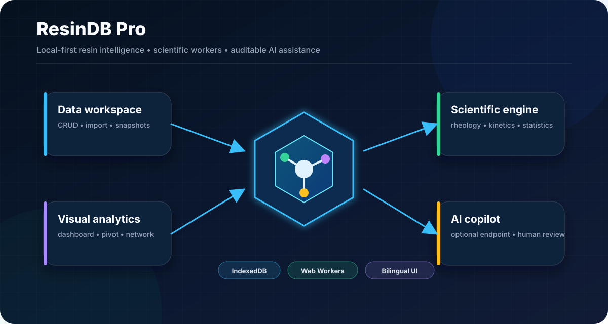
</p>

<p align="center">
  <a href="https://github.com/SUNHAOJUN22/ResinDB-Pro-by-SunHJ/actions/workflows/ci.yml"></a>
  
  
  
  
  
</p>

**ResinDB Pro** 是一个浏览器端合成树脂数据管理、检索、比较、可视化与探索性计算平台。它把材料记录、分类目录、关系网络、科学计算 Worker、报告导出和可选 AI 辅助分析组织在同一个可审计工作区中。

> [!IMPORTANT]
> ResinDB Pro 是研究与工程演示软件，不是经过认证的 LIMS、ERP、质量放行系统、制造商官方牌号库或法规判定系统。演示数据、统计模型、公式和 AI 输出必须由原始检测报告、标准方法与专业人员复核。

## 能力地图

| 场景 | 已实现能力 | 必须保留的边界 |
|---|---|---|
| 树脂数据管理 | 牌号 CRUD、批量编辑、分类、筛选、标签、历史、快照 | 默认保存在当前浏览器 IndexedDB |
| 数据交换 | CSV、JSON、TXT 导入；CSV、JSON、XML、PDF 导出 | 导入者负责确认来源、单位、授权与测试条件 |
| 材料分析 | Dashboard、Analytics、Pivot、牌号比较、关系网络 | 探索性结果不替代标准试验或质量放行 |
| 科学计算 | 流变、动力学、可靠性、统计、敏感性、优化、数据质量 | 有效输入必须返回有限结果，异常不得静默吞掉 |
| AI 辅助 | 可选 OpenAI-compatible endpoint，基于所选记录组织分析 | 不内置供应商，不自动替代专业判断 |
| 数据适配 | 本地 IndexedDB 或可选远程 REST adapter | 远程认证、授权、审计和备份由服务端实现 |
| 反馈诊断 | 本地反馈队列、环境摘要、敏感字段脱敏、JSON 导出 | 当前仓库不包含反馈接收服务端 |

## 数据生命周期

<p align="center">
  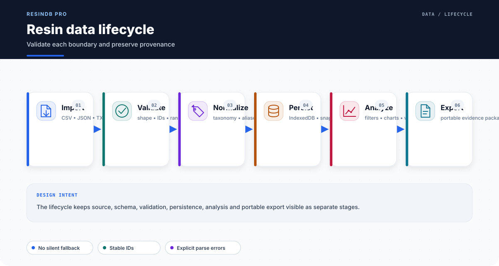
</p>

树脂分类、目录、关系与材料记录集中在 `src/data/`，没有重新硬编码进 React 组件。Loader 同时接受旧数组格式和带 `schemaVersion`、`dataKind`、`sourceType`、`recordStatus`、`updatedAt`、`data` 元数据的版本化文档，并检查损坏记录、重复 ID 和分类环路。

## 数据治理与来源

<p align="center">
  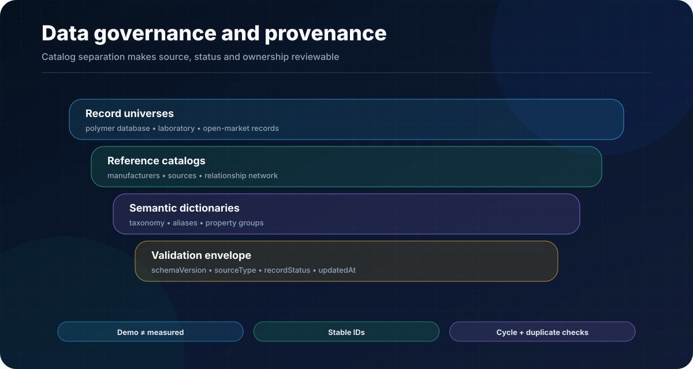
</p>

| 文件 | 用途 |
|---|---|
| `resin-taxonomy.json` | 树脂分类树 |
| `resin-category-aliases.json` | 分类代码与别名 |
| `resin-property-groups.json` | 物性字段分组 |
| `resin-manufacturers.json` | 厂家目录 |
| `resin-references.json` | 参考来源目录 |
| `resin-network.json` | 原料、树脂和关系网络 |
| `polymerDatabase.json` | 演示材料数据库 |
| `myLabUniverse.json` | 独立实验室记录数据集 |
| `openMarketUniverse.json` | 独立市场记录数据集 |
| `resinData.ts` | loader、结构校验与确定性 fallback |

演示记录不得冒充实测数据、制造商正式规格或法规认可数据。

## 科学计算引擎

<p align="center">
  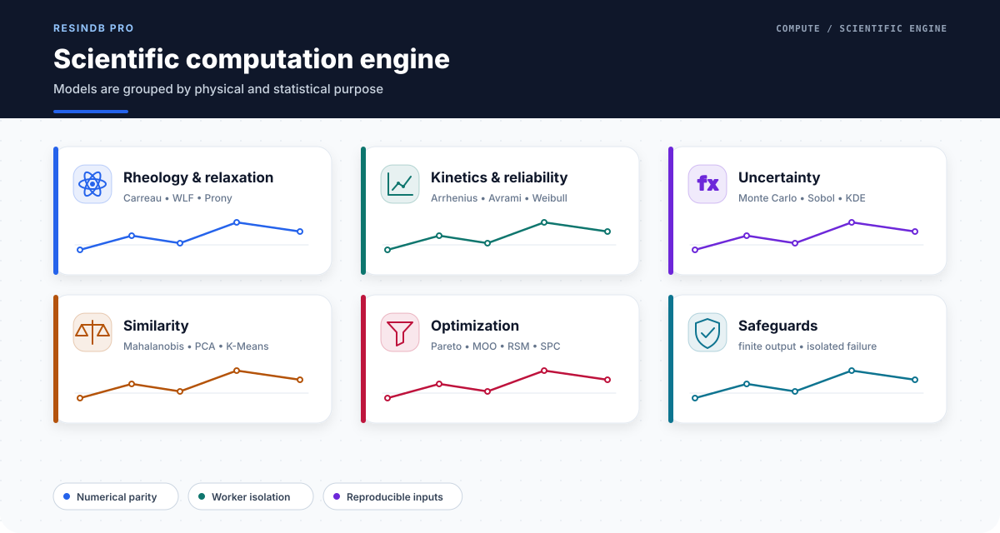
</p>

主要计算能力包括：

- **流变与松弛**：Carreau、WLF、Prony；
- **动力学与可靠性**：Arrhenius、Kissinger、Avrami、Weibull、耐久性分析；
- **统计与不确定度**：Monte Carlo、Sobol、Copula、KDE、Bayes、预测；
- **相似性与多变量分析**：Mahalanobis、Spearman、K-Means、PCA、相似度；
- **优化与质量**：Pareto、MOO、RSM、SPC、数据质量、特征重要性。

## Web Worker 架构

<p align="center">
  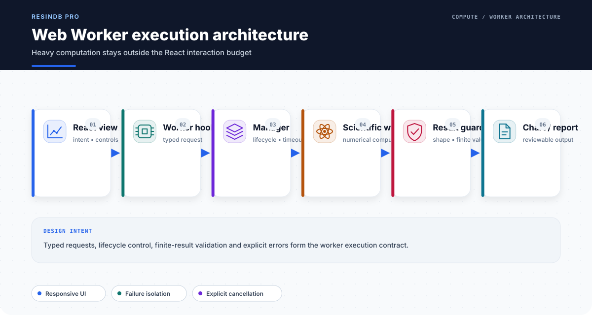
</p>

计算密集型任务优先在独立 Worker 中运行。Worker hook 和 manager 负责消息形状、生命周期与错误隔离；科学回归测试要求主要 Worker 对有效输入返回有限数值，避免未处理的 `ERROR`、`NaN` 或 `Infinity`。

## 白名单公式引擎

<p align="center">
  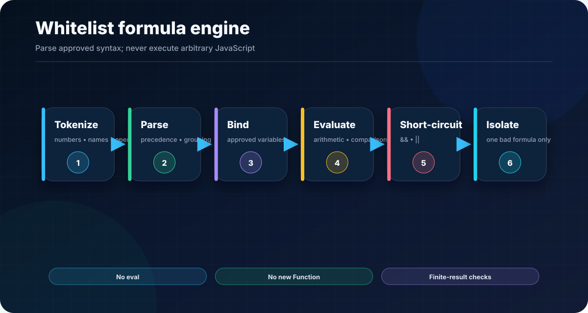
</p>

公式引擎支持算术、比较、`&&`、`||`、短路求值和单公式故障隔离。用户表达式不会通过 `eval` 或 `new Function` 作为任意 JavaScript 执行。

## 树脂知识网络

<p align="center">
  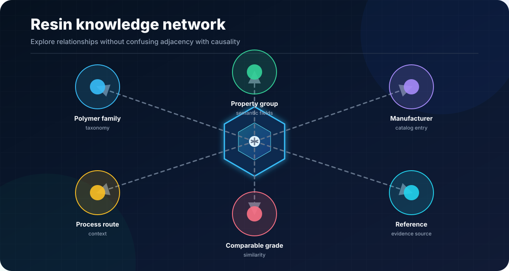
</p>

关系网络用于浏览目录连接和候选关联。邻接关系不是因果证据，不能直接解释为结构—性能机理。

## 牌号比较与决策支持

<p align="center">
  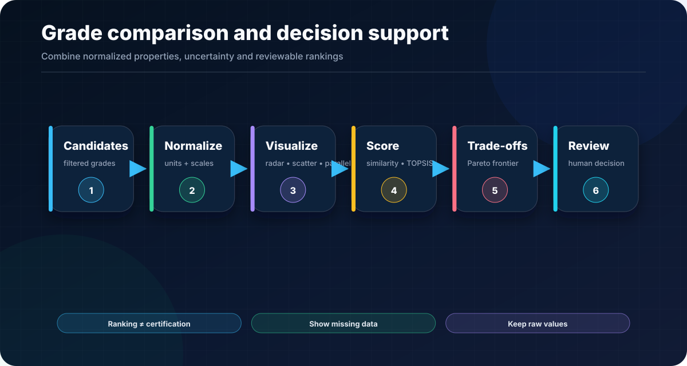
</p>

比较工具保留原始数值，同时提供雷达图、散点图、平行坐标、相似度、TOPSIS 和 Pareto 等探索工具。排名不构成认证，缺失数据必须显式展示。

## AI 辅助分析

<p align="center">
  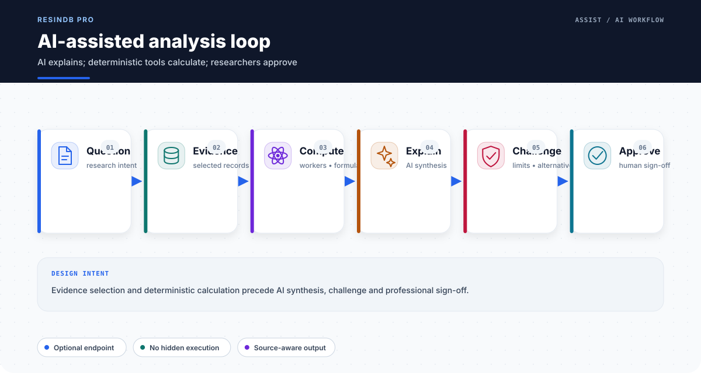
</p>

AI 能力默认关闭，平台不内置或强制选择任何供应商。推荐流程是：明确问题 → 选择并核对记录 → 由公式和 Worker 计算 → AI 组织解释与限制 → 专业人员复核。AI 输出不构成试验事实、法规结论、牌号认证或质量放行。

## 本地优先与隐私

<p align="center">
  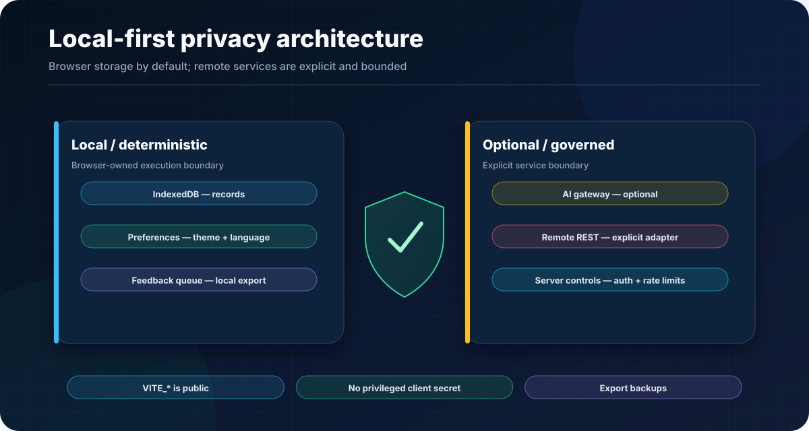
</p>

默认配置使用 IndexedDB。语言、主题、配色、历史和待处理反馈保存在浏览器侧。远程 adapter 与 AI endpoint 只有在显式配置后才会调用。

> [!WARNING]
> 所有 `VITE_*` 环境变量都会进入前端构建。只能使用受限的本地开发 token；生产环境必须通过具有认证、授权、限流和审计的服务端网关调用外部服务。

## 导入、导出与报告

<p align="center">
  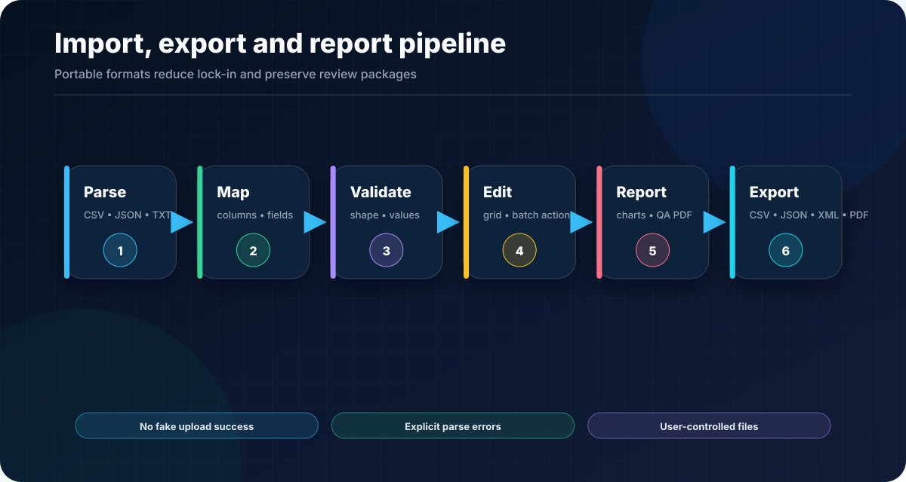
</p>

导入流程必须暴露解析与映射错误；导出支持 CSV、JSON、XML 与 PDF。QA 报告和图表是评审材料，不替代原始试验报告。

## 自动测试与质量门

<p align="center">
  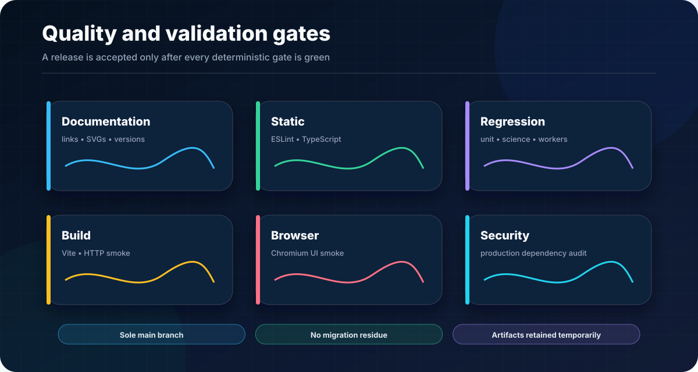
</p>

提交前执行：

```bash
npm run validate
```

完整验证执行：

```bash
npm run validate:ci
```

文档、视觉资产和生产源码可以单独检查：

```bash
npm run validate:docs
npm run validate:source
npm run visuals:check
```

永久 CI 逐项执行：

```bash
npm ci
npm run validate:docs
npm run validate:source
npm run lint
npm run typecheck
npm run test
npm run test:unit
npm run test:science
npm run test:coverage
npm run build
npm run smoke
npm run test:ui
npm run audit:prod
```

`validate:source` 只扫描 `src/` 下的生产 TypeScript/JavaScript，拒绝 TypeScript/ESLint 抑制、任意代码执行、危险 HTML 注入和未完成标记。用于证明公式引擎拒绝恶意表达式的负向安全样本保留在 `tests/`，不会再被错误当成生产风险。

当前最新完整验证基线使用 Node.js 22 / npm 10 / Python 3.12 / Linux，记录 **10 个测试文件、82 个测试用例** 全部通过，验证 **14 张确定性功能图**，并通过中文浅色和英文深色 Dashboard Chromium smoke。精确退出码、覆盖率与图像清单见 [`reports/final-visual-upgrade-20260726/REPORT.md`](reports/final-visual-upgrade-20260726/REPORT.md)、[`reports/ci-validation-latest.json`](reports/ci-validation-latest.json) 和 [`docs/VALIDATION.md`](docs/VALIDATION.md)。

应用内帮助中心与本 README 使用同一能力边界：CSV/JSON/TXT 导入，CSV/JSON/XML/PDF 导出；Admin、Editor、Viewer 仅为界面演示角色，不构成真实认证或 RBAC 安全边界。

## 典型科研工作流

<p align="center">
  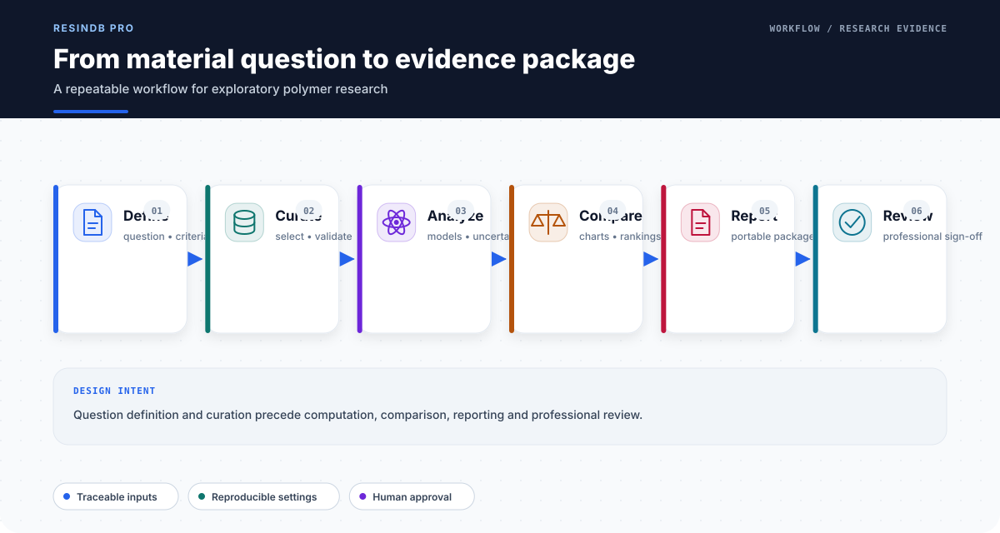
</p>

一个可复核的路径是：定义问题与接受标准 → 整理记录 → 执行模型和不确定度分析 → 比较候选牌号 → 导出数据、图表与 QA 报告 → 专业人员签核。

## 安全与部署边界

<p align="center">
  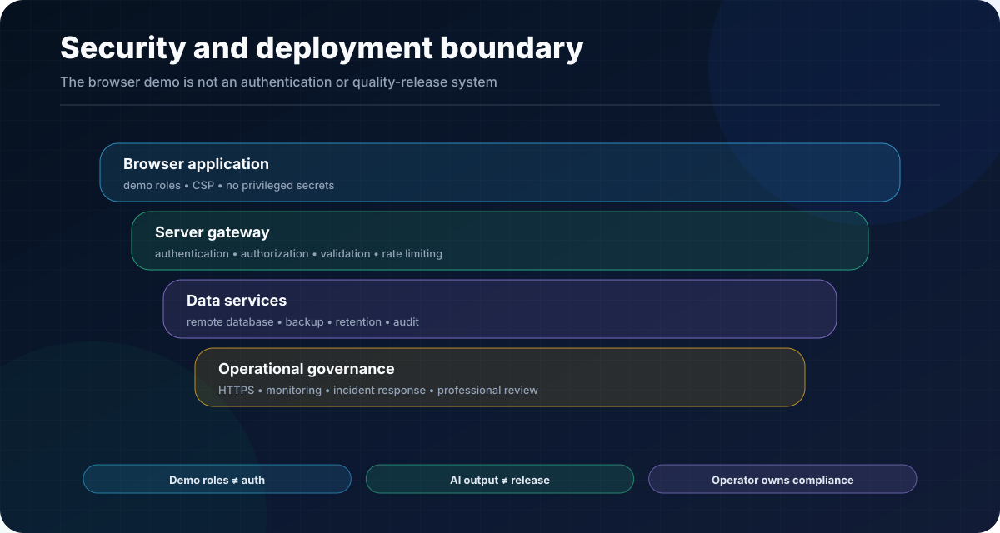
</p>

- Demo Admin、Editor、Viewer 只是前端演示角色，不是安全认证；
- 远程身份、权限、仪器连接、审计、备份和质量放行不包含在本仓库中；
- 生产部署应启用 HTTPS、CSP、安全响应头、服务端校验、限流、监控和事件响应；
- 第三方 API、制造商数据和法规要求必须由部署方独立核验。

更多说明见 [`SECURITY.md`](SECURITY.md)。

## 快速开始

### 环境要求

- Node.js **22 LTS**；
- npm **10+**；
- Chromium-compatible browser（仅 `test:ui` 需要）；
- Python **3.10+**（README 视觉生成和文档校验使用标准库）。

### 安装与运行

```bash
git clone https://github.com/SUNHAOJUN22/ResinDB-Pro-by-SunHJ.git
cd ResinDB-Pro-by-SunHJ
npm ci
npm run dev
```

默认开发地址为 `http://127.0.0.1:3000`。

### 环境配置

```bash
cp .env.example .env.local
```

| 变量 | 说明 |
|---|---|
| `VITE_AI_API_ENDPOINT` | 完整 OpenAI-compatible chat-completions endpoint |
| `VITE_AI_MODEL` | 服务端要求的模型标识 |
| `VITE_AI_API_KEY` | 仅限受限的本地开发 token |
| `VITE_DATABASE_ADAPTER_TYPE` | `indexeddb`（默认）或 `remote_api` |
| `VITE_REMOTE_API_BASE_URL` | 远程 REST 基础路径 |
| `VITE_REMOTE_READ_FALLBACK` | 远程读取/导出的本地 fallback 开关 |

远程写入失败不会静默回退到 IndexedDB，以免浏览器和服务器形成分叉数据库。

## 十四张可复现功能图

本 README 的**十四张**功能图由 AI 辅助设计，并通过仓库脚本确定性生成；不依赖外部图片链接：

```bash
npm run visuals:generate
npm run visuals:check
```

生成器使用 Python 标准库，自动检查 SVG XML、`<title>`、`<desc>`、`role="img"` 和 `aria-labelledby`。`validate:docs` 还会检查：

- README 是否引用全部 14 张图且不存在断链；
- 图片是否与生成器输出逐字节一致；
- README、`package.json` 与验证合同的版本是否一致；
- 正式 CI 是否执行文档与生产源码卫生检查；
- 仓库是否重新出现旧 patch、trigger、迁移或诊断残留；
- 最新机器摘要是否与固定报告目录一致，避免证据链接漂移；
- 当前树验证不得保留失败状态或非零退出码。

架构 SVG 是说明性图示，不是运行截图。真实 Chromium PNG、原始日志和 Coverage HTML 作为 GitHub Actions artifact 限时保存，不会被伪装成仓库静态证据。

## 项目结构

```text
.
├── .github/workflows/ci.yml       # main 分支永久质量门
├── docs/
│   ├── VALIDATION.md              # 验证合同与证据保留规则
│   └── assets/                    # 14 张确定性 SVG
├── scripts/
│   ├── generate-readme-visuals.py
│   ├── validate-repository-docs.py
│   ├── validate-source-hygiene.py
│   ├── run-test-files.mjs
│   ├── smoke-test.mjs
│   └── ui-smoke-test.mjs
├── src/
│   ├── components/
│   ├── contexts/
│   ├── data/
│   ├── hooks/
│   ├── lib/
│   ├── services/
│   └── workers/
├── tests/
│   ├── science/
│   └── unit/
├── package.json
└── vite.config.ts
```

## 分支策略

唯一长期维护分支为 **`main`**。正式 CI 在 `main` push 时核对远程分支清单，并拒绝存在额外远程分支的发布验证。
