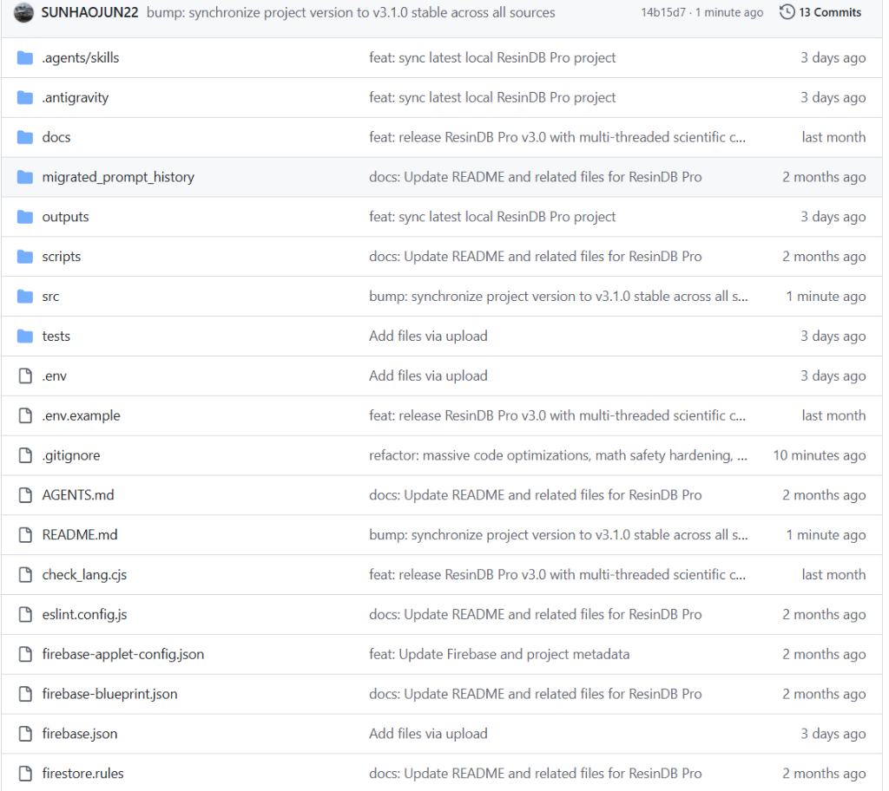
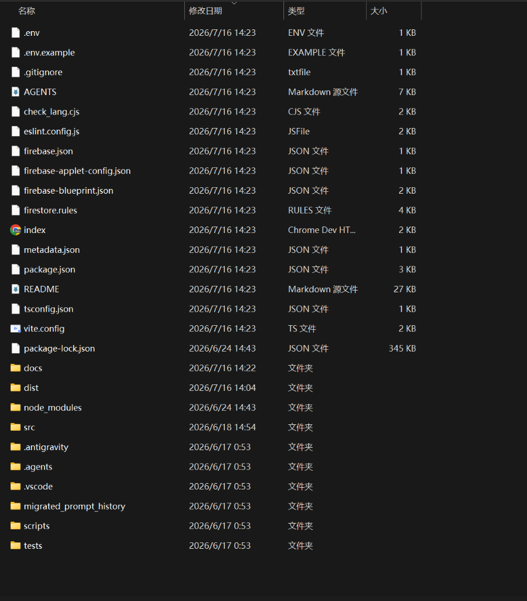
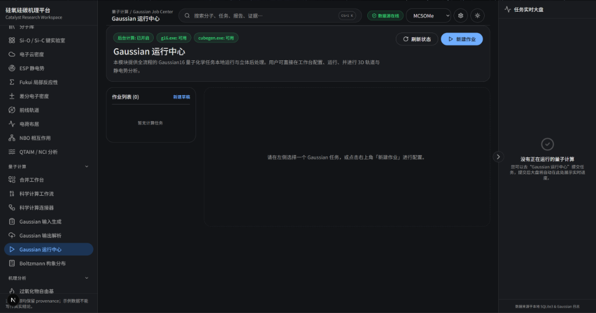

<div align="center">

# ResinDB Pro

### 合成树脂产品数据管理与材料信息学分析前端

**Synthetic Resin Data Management & Materials-Informatics Workbench**

[](https://github.com/SUNHAOJUN22/ResinDB-Pro-by-SunHJ/actions/workflows/ci.yml)


面向合成树脂牌号、实验记录和理化性能数据的浏览器端研究工作台。项目集成数据表格、筛选、导入导出、图表分析、Web Worker 科学计算、可配置公式和可选的 Gemini 辅助分析。

> **定位说明**：本仓库是研究与工程演示应用，不是经过认证的 LIMS、质量放行系统、法规判定工具或生产数据库。所有材料结论、AI 建议和计算结果都应由可追溯数据与实验方法复核。

</div>

---

## 目录

- [项目状态](#项目状态)
- [界面演示](#界面演示)
- [核心能力](#核心能力)
- [技术架构](#技术架构)
- [实机运行演示](#实机运行演示)
- [数据存储模式](#数据存储模式)
- [AI 功能配置](#ai-功能配置)
- [安全公式引擎](#安全公式引擎)
- [质量验证](#质量验证)
- [部署](#部署)
- [已知限制](#已知限制)
- [安全说明](#安全说明)

---

## 项目状态

| 模块 | 状态 | 客观说明 |
|---|---:|---|
| 产品目录、检索、筛选与列配置 | 已实现 | 浏览器端运行，默认使用 IndexedDB 持久化 |
| CSV / XLSX / JSON 等导入导出 | 已实现 | 导入前仍应核对字段映射、单位与数据来源 |
| Dashboard、对比、透视与分析视图 | 已实现 | 图表用于探索性分析，不等同于统计验证报告 |
| Web Worker 科学计算 | 已实现 | 用于降低主线程阻塞；每个模型仍需独立验证数值边界 |
| 用户自定义公式 | 已实现 | 使用白名单数值解析器，不执行任意 JavaScript |
| Gemini 辅助分析 | 可选 | 本地演示可直接配置；生产环境应使用服务端代理 |
| 远程 REST 数据适配器 | 接口已实现 | 本仓库不包含配套后端；写失败不会静默写入本地库 |
| 登录与角色 | 演示模式 | 当前为内置角色选择，不是身份认证或访问控制系统 |
| 法规、标准与产品认证 | 未提供 | 系统不会自动形成 ASTM、ISO、企业标准或质量放行结论 |

---

## 界面演示

### 1. 数据仪表盘



产品目录、指标概览、筛选和高密度数据浏览。

### 2. 材料分析工作区



用于属性关系、分布、材料对比和探索性可视化。

### 3. 科学计算沙箱



用于流变、动力学、寿命与统计模型的交互式试算。

---

## 核心能力

### 数据管理

- 合成树脂牌号与制造商信息管理；
- 多类别树、标签、完整度和高级过滤；
- 批量编辑、批量标签、排序与历史快照；
- 浏览器端 IndexedDB 数据适配器；
- 可切换的远程 REST API 适配器；
- CSV、XLSX、JSON、XML 等导入导出路径。

### 材料信息学与可视化

- 属性散点、分布、相关性和相似性分析；
- Ashby 类材料空间探索；
- GPC、流变、WLF、Prony、Weibull、Arrhenius、结晶动力学等交互模型；
- SPC、聚类、多目标分析与预测类 Worker；
- Dashboard、Comparison、Pivot、Analytics 和 Sandbox 视图。

### 工程能力

- React 19 + TypeScript 严格模式；
- Vite 6 构建与代码分块；
- 计算密集任务通过 Web Worker 与 UI 解耦；
- Error Boundary、上下文状态、懒加载和本地持久化；
- Vitest 科学计算测试与 GitHub Actions 质量门禁；
- 生产构建后自动启动 HTTP 服务进行烟雾测试。

---

## 技术架构

```text
index.html
└── src/index.tsx                 # React 挂载与顶层错误边界
    └── src/components/App.tsx    # 应用组合、视图路由与 Provider
        ├── components/           # 页面、布局、图表、弹窗和控件
        ├── contexts/             # Auth / Data / UI / Theme / Toast 等状态
        ├── hooks/                # 数据、快捷键、导出与 Worker Hooks
        ├── lib/
        │   ├── adapters/         # IndexedDB 与 Remote REST 数据接口
        │   ├── formulaParser.ts  # 白名单公式解析与拓扑执行
        │   └── ...               # 筛选、数学与材料工具
        ├── services/             # Gemini 与应用服务
        └── workers/              # 后台科学计算任务
```

### 数据流

```text
UI Component
    ↓ user action
Context / Hook
    ↓ typed adapter call
IndexedDB Adapter  ──────────────── default local mode
       or
Remote API Adapter ─────────────── explicit remote mode
    ↓
state update / rollback / toast / history snapshot
```

### 设计原则

1. **数据源必须明确**：本地库与远程库不可静默混写。
2. **计算必须可审计**：公式仅允许受控数值语法；科学算法应有单元测试和适用范围。
3. **AI 必须标注不确定性**：AI 输出是候选解释或实验假设，不是实测数据。
4. **失败必须可见**：不通过全局覆盖 `console.warn` 隐藏运行时问题。
5. **构建必须可复现**：CI 使用 `npm ci` 和已提交锁文件。

---

## 实机运行演示

### 0. 环境要求

建议使用：

- Node.js `20.19+` 或 Node.js `22 LTS`；
- npm `10+`；
- Chrome、Edge 或 Firefox 的当前稳定版本；
- 至少 4 GB 可用内存；大数据导入和多图表分析建议 8 GB 以上。

检查环境：

```bash
node --version
npm --version
```

### 1. 获取代码

```bash
git clone https://github.com/SUNHAOJUN22/ResinDB-Pro-by-SunHJ.git
cd ResinDB-Pro-by-SunHJ
```

### 2. 安装锁定依赖

```bash
npm ci
```

`npm ci` 不会改写锁文件；若该命令失败，应先修复 `package.json` 与 `package-lock.json` 的差异，而不是直接删除锁文件。

### 3. 配置本地环境

macOS / Linux：

```bash
cp .env.example .env.local
```

Windows PowerShell：

```powershell
Copy-Item .env.example .env.local
```

默认 IndexedDB 模式无需填写任何密钥即可运行。AI 功能可保持为空。

### 4. 启动开发服务器

```bash
npm run dev
```

浏览器打开：

```text
http://localhost:3000
```

### 5. 登录演示

启动页提供 `admin`、`editor`、`viewer` 三种内置演示角色。点击角色卡片即可进入，不需要密码。

这只是 UI 权限演示：

- 不会验证真实身份；
- 不应暴露到不可信网络；
- 不能替代 OAuth、OIDC、SSO、会话管理或服务端授权。

### 6. 数据浏览演示

进入 Dashboard 后：

1. 使用顶部搜索框输入牌号、制造商、类别或属性关键词；
2. 在左侧类别树选择 PE、PP 或其他材料分类；
3. 调整完整度阈值，观察缺失字段记录的过滤；
4. 打开列配置，固定或隐藏属性列；
5. 选择多条记录，测试批量标签、编辑和导出；
6. 刷新页面，验证 IndexedDB 数据仍然保留。

高级数值检索支持“属性:条件”形式。属性名必须与当前数据列或翻译标签匹配，例如：

```text
Density:>0.94
MFR:0.5-2
Tensile Strength:>=30
```

### 7. 分析视图演示

1. 切换到 **Analytics**；
2. 选择目标属性与分组；
3. 查看分布、相关性或材料空间图；
4. 切换到 **Comparison** 比较候选牌号；
5. 切换到 **Sandbox** 输入模型参数并运行 Worker 计算；
6. 对任何结论记录单位、样本量、测试标准和适用温度。

### 8. 用户公式演示

公式编辑器支持属性引用、算术运算和白名单数学函数：

```text
Props['Density'] * 1000
sqrt(pow(Props['Tensile Strength'], 2) + abs(Props['Impact Strength']))
max(Props['MFR'], 0.01) / Props['Density']
```

循环依赖会在保存前被拒绝，例如：

```text
A = Props['B'] + 1
B = Props['A'] + 1
```

### 9. 生产构建与真实 HTTP 烟雾测试

```bash
npm run build
npm run smoke
```

`npm run smoke` 会：

1. 使用已生成的 `dist/`；
2. 启动 `vite preview`；
3. 请求 `http://127.0.0.1:4173`；
4. 检查 HTTP 状态和 React `#root` 挂载节点；
5. 自动停止预览服务。

完整验证：

```bash
npm run validate
```

执行顺序为：

```text
ESLint → TypeScript → Vitest → Vite production build → HTTP smoke test
```

---

## 数据存储模式

### IndexedDB：默认推荐的本地演示模式

`.env.local`：

```dotenv
VITE_DATABASE_ADAPTER_TYPE=indexeddb
```

特点：

- 不需要服务器；
- 数据保存在当前浏览器配置文件中；
- 不会自动跨设备同步；
- 清理站点数据或更换浏览器配置文件会丢失本地数据；
- 适合演示、个人研究和前端开发。

### Remote REST API：需要自行提供后端

```dotenv
VITE_DATABASE_ADAPTER_TYPE=remote_api
VITE_REMOTE_API_BASE_URL=https://your-api.example.com/api
VITE_REMOTE_READ_FALLBACK=false
```

当前前端期望的主要端点包括：

```text
GET    /products
POST   /products
PUT    /products/:id
PATCH  /products/batch-update
POST   /products/batch-create
POST   /products/batch-delete
POST   /products/export?format=...
POST   /products/restore-snapshot
```

重要行为：

- 远程写入失败会向上抛出错误，供 UI 回滚；
- 不会把失败写入静默转移到 IndexedDB；
- `VITE_REMOTE_READ_FALLBACK=true` 仅允许查询和导出显式降级；
- 生产后端必须实现鉴权、授权、输入校验、并发控制、审计日志和数据库事务。

---

## AI 功能配置

### 本地演示

```dotenv
VITE_GEMINI_API_KEY=your_disposable_restricted_key
VITE_GEMINI_FAST_MODEL=gemini-3.5-flash
VITE_GEMINI_REASONING_MODEL=gemini-3.1-pro-preview
```

### 关键安全事实

Vite 会把所有 `VITE_*` 环境变量打包到浏览器资源中，因此前端 API Key **不是秘密**。本地演示只能使用：

- 可随时撤销的开发 Key；
- 最小 API 权限；
- 来源、配额和账单限制；
- 不接触敏感数据的测试环境。

生产环境推荐：

```text
Browser → authenticated application backend → AI gateway/provider
```

服务端至少应实现：

- 用户身份与权限校验；
- 请求大小和字段白名单；
- Prompt 注入与数据泄漏防护；
- 速率限制、配额和超时；
- 模型版本配置；
- 日志脱敏与审计；
- 机密管理服务。

### AI 输出边界

AI 生成的属性值、替代材料和配方建议必须标记为估算或假设。不得直接作为：

- 厂商正式规格；
- 检测报告；
- 安全合规结论；
- 采购验收依据；
- 工艺放大参数；
- 产品质量放行依据。

---

## 安全公式引擎

旧式公式执行常使用 `eval` 或 `new Function`，黑名单无法可靠阻止原型链、构造器和全局对象逃逸。ResinDB Pro 的公式引擎现在使用受限解析器，只接受：

- 数值与科学计数法；
- `Props['property']` / `p['property']`；
- `+ - * / % ^ **`；
- 括号和逗号；
- `PI`、`Math.PI`、`E`、`Math.E`；
- `abs`、`sqrt`、`pow`、`log`、`log10`、`exp`、`sin`、`cos`、`tan`、`min`、`max`。

下列内容会被拒绝：

```text
window
fetch
constructor
__proto__
object literals
property chaining
ternary expressions
arbitrary function calls
```

非有限结果（如除以零或 `sqrt(-1)`）归一化为 `0`，避免污染后续公式图。

---

## 质量验证

### 常用命令

| 命令 | 作用 |
|---|---|
| `npm run lint` | ESLint，任何 warning 均使任务失败 |
| `npm run typecheck` | TypeScript 严格类型检查 |
| `npm run test` | 全部 Vitest 测试 |
| `npm run test:science` | 科学计算与数据适配器测试 |
| `npm run test:coverage` | 生成覆盖率报告 |
| `npm run build` | Vite 生产构建 |
| `npm run smoke` | 生产构建 HTTP 烟雾测试 |
| `npm run validate` | 完整质量门禁 |

### CI

`.github/workflows/ci.yml` 在以下场景运行：

- 推送到 `main`；
- 推送到 `agent/**` 分支；
- 针对 `main` 的 Pull Request。

CI 使用 Node.js 22 和 `npm ci`，从而检测锁文件漂移、类型错误、测试失败、构建错误和生产入口不可访问等问题。

---

## 部署

### 静态托管

```bash
npm ci
npm run build
```

将 `dist/` 部署到支持静态资源的服务，例如 Nginx、Cloud Storage + CDN、Cloudflare Pages、Netlify 或 Vercel 静态站点。

Nginx 最小示例：

```nginx
server {
    listen 80;
    server_name resindb.example.com;
    root /var/www/resindb/dist;

    location / {
        try_files $uri $uri/ /index.html;
    }

    location /assets/ {
        add_header Cache-Control "public, max-age=31536000, immutable";
    }
}
```

### 生产检查清单

- [ ] 已撤销所有曾提交到 Git 的密钥；
- [ ] 已接入真实身份认证和服务端授权；
- [ ] 已关闭前端直连 AI Key；
- [ ] 已固定允许的 API Origin 与 CSP；
- [ ] 已配置 HTTPS、HSTS 和安全响应头；
- [ ] 已定义数据库备份、恢复与迁移流程；
- [ ] 已实现远程 API 幂等、事务和并发版本控制；
- [ ] 已用代表性材料数据验证所有公式和 Worker；
- [ ] 已记录单位、试验条件、标准与数据血缘；
- [ ] `npm run validate` 与 GitHub Actions 均通过。

---

## 已知限制

1. 当前登录页是演示账户选择器，不提供真实鉴权。
2. 默认数据库位于浏览器 IndexedDB，不适合多人协同或集中治理。
3. 远程适配器只定义前端契约，后端服务不在本仓库内。
4. 科学计算模块数量较多，不能由少量单元测试证明全部数值正确。
5. 浏览器内大规模 XLSX、PDF 和图表处理受内存限制。
6. AI 模型名称和可用性会随供应商生命周期变化，应通过配置与 CI 定期验证。
7. 演示截图反映特定版本与数据状态，实际界面可能随数据和分辨率变化。
8. 仓库尚未提供明确的开源许可证；在许可证补充前，不应假设可自由再分发或商用。

---

## 安全说明

仓库历史中曾出现被提交的 API 凭据。当前代码树删除该文件并补充了 `.gitignore` 与安全文档，但删除文件不能撤销或自动清除历史密钥。

仓库维护者必须立即：

1. 在供应商控制台撤销旧 Key；
2. 检查调用量、账单和异常来源；
3. 创建受限的新 Key；
4. 在生产中改用服务端 Secret Manager；
5. 阅读 [SECURITY.md](./SECURITY.md)。

---

## 贡献与变更原则

提交前运行：

```bash
npm ci
npm run validate
```

Pull Request 应说明：

- 问题与复现步骤；
- 数据或物理模型假设；
- 修改范围；
- 新增测试；
- 兼容性与迁移影响；
- 对安全、性能和数据一致性的影响。

对于科学模型，请同时提供方程、单位、参数边界、参考实现或可复现对照数据。

---

<div align="center">

**ResinDB Pro — evidence before claims, reproducibility before presentation.**

</div>
