# ResinDB Pro by SunHJ

<p align="center">
  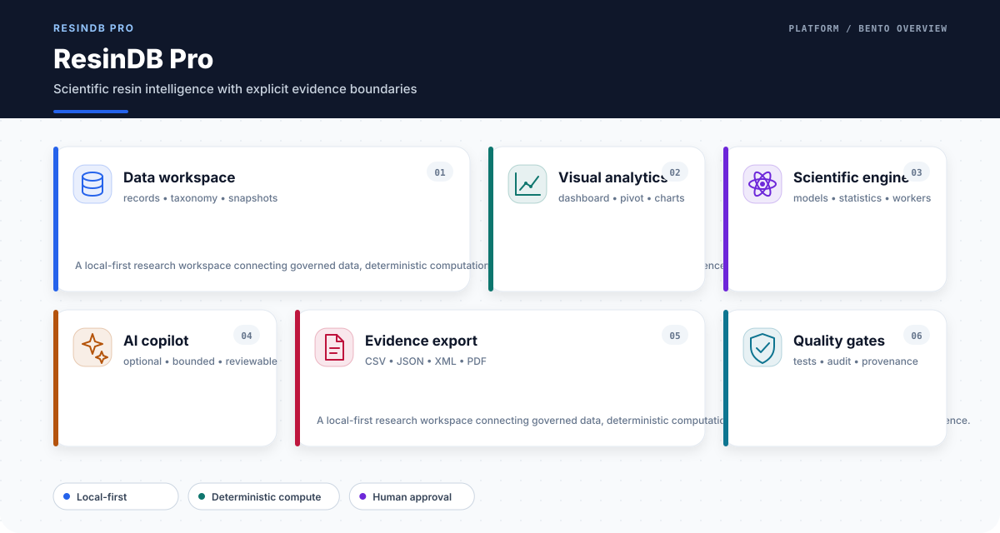
</p>

<p align="center">
  <a href="https://github.com/SUNHAOJUN22/ResinDB-Pro-by-SunHJ/actions/workflows/ci.yml"></a>
  
  
  
  
  
</p>

**ResinDB Pro** 是面向合成树脂研究、数据治理、牌号比较和探索性数理分析的浏览器端材料信息平台。它把独立树脂数据资产、IndexedDB 工作区、科学 Web Worker、交互式图表、报告导出和可选 AI 辅助组织在一个可审计、可复现的系统中。

> [!IMPORTANT]
> 本项目是科研与工程演示软件，不是经过认证的 LIMS、ERP、质量放行系统、制造商官方牌号库或法规判定系统。演示数据、统计模型、公式和 AI 输出必须由原始检测报告、标准方法及专业人员复核。

## 核心价值

| 目标 | ResinDB Pro 的实现 | 质量边界 |
|---|---|---|
| 数据不锁在 UI | 根目录 `data/` 是唯一权威树脂数据源，构建时生成 `/data/` 运行时资产 | React/TypeScript bundle 不含完整牌号目录 |
| 数据可追溯 | 版本、来源类型、记录状态、Schema、字节数和 SHA-256 进入 manifest | demo、reference、measured、imported 明确区分 |
| 分析不中断交互 | 流变、动力学、可靠性、统计和优化优先在 Worker 中执行 | 非有限值、超时和错误必须显式隔离 |
| 图表可验证 | Dashboard、Analytics、Pivot、关系网络和牌号比较均有 Chromium smoke | 空状态、详情、交互节点和移动布局均纳入证据 |
| AI 有边界 | AI 只在显式配置后参与解释、候选整理和研究辅助 | AI 不制造实验事实，不替代专业签核 |
| 发布可审计 | docs、数据、源码、测试、覆盖率、构建、浏览器和依赖审计逐项门禁 | 不允许 `continue-on-error` 或降低测试标准 |

## 功能地图

- **树脂数据管理**：CRUD、批量编辑、分类、筛选、标签、快照、历史恢复和 IndexedDB 持久化。
- **数据交换**：CSV、JSON、TXT 导入；CSV、JSON、XML、PDF 导出；解析和映射错误可见。
- **材料分析**：Dashboard、Analytics、Pivot、牌号比较、相似度、TOPSIS、Pareto 和依赖网络。
- **科学计算**：Carreau、WLF、Prony、Arrhenius、Kissinger、Avrami、Weibull、Monte Carlo、Sobol、Copula、KDE、Mahalanobis、K-Means、PCA、RSM、SPC 等。
- **质量与反馈**：数据完整性、公式隔离、本地反馈队列、敏感字段脱敏和 JSON 诊断导出。
- **国际化与可访问性**：中文/英文、明暗模式、多套配色、语义标签和键盘可操作控件。

## 外置树脂数据架构

<p align="center">
  
</p>

<p align="center">
  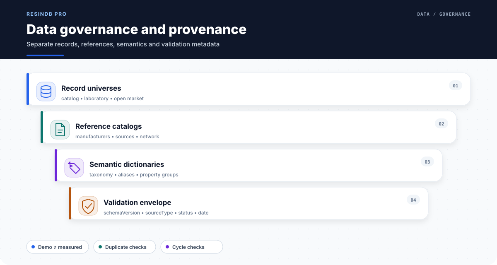
</p>

`data/` 是唯一权威数据目录；`dist/data/` 是构建生成物并被 `.gitignore` 排除。应用通过运行时 `fetch` 读取 `/data/resins/*.json`，CI 同时核验根 manifest 及其列出的文件，而不是将完整 JSON 静态导入 JavaScript。

```text
data/
├── manifest.json                         # 文件路径、类型、字节数、SHA-256
├── metadata.json                         # 数据治理、来源、单位和使用边界
├── version.json                          # 应用/数据/Schema 兼容版本
├── schemas/
│   ├── resin-data-document.schema.json
│   └── resin-product.schema.json
└── resins/
    ├── polymerDatabase.json
    ├── myLabUniverse.json
    ├── openMarketUniverse.json
    ├── resin-taxonomy.json
    ├── resin-category-aliases.json
    ├── resin-property-groups.json
    ├── resin-manufacturers.json
    ├── resin-references.json
    └── resin-network.json
```

每个数据文档包含 `schemaVersion`、`dataKind`、`sourceType`、`recordStatus`、`updatedAt` 和 `data`。Loader 与 CI 检查重复 ID、分类环路、跨目录引用、字节数、SHA-256、记录结构以及非有限数值。详细合同见 [`docs/DATA_ARCHITECTURE.md`](docs/DATA_ARCHITECTURE.md)。

## 科学分析体系

<p align="center">
  
</p>

<p align="center">
  
</p>

<p align="center">
  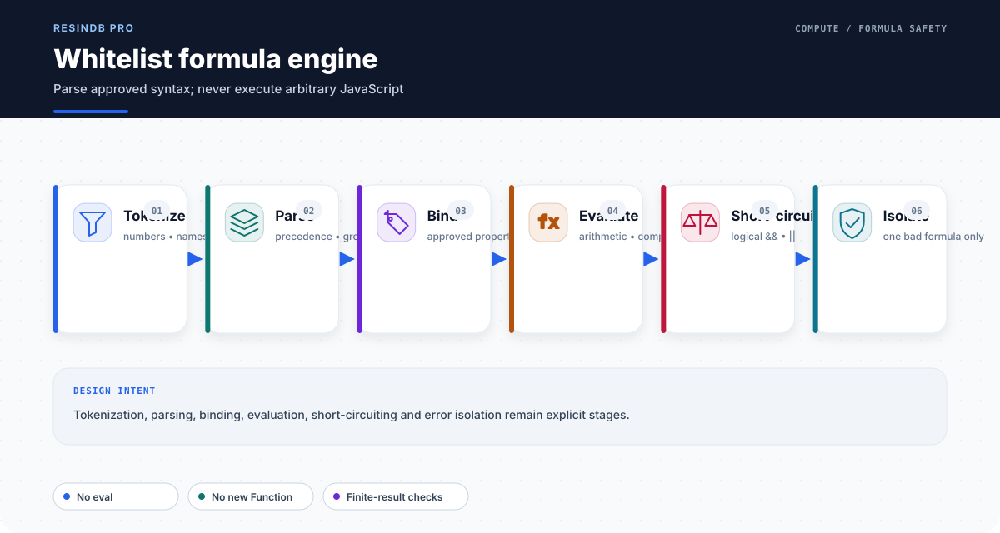
</p>

计算密集型任务通过懒加载视图和 Web Worker 减少主线程阻塞。白名单公式解析器支持算术、比较、`&&`、`||` 和短路求值，不使用 `eval` 或 `new Function`。有效输入必须返回有限结果；坏公式只能影响自身，不能破坏相邻计算。

## 聚合物结构与分子信息

<p align="center">
  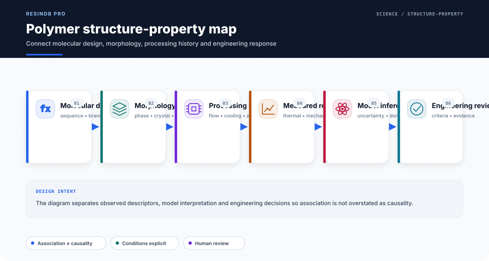
</p>

<p align="center">
  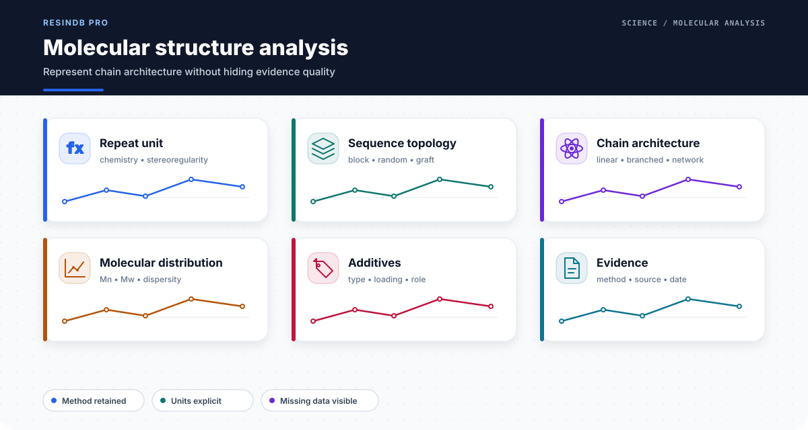
</p>

结构—性能图用于组织证据，而不是把邻接或相关性冒充因果关系。分子序列、支化、分子量分布、结晶和界面等描述必须保留方法、条件和来源。

## 流变、热、力学与电学分析

<p align="center">
  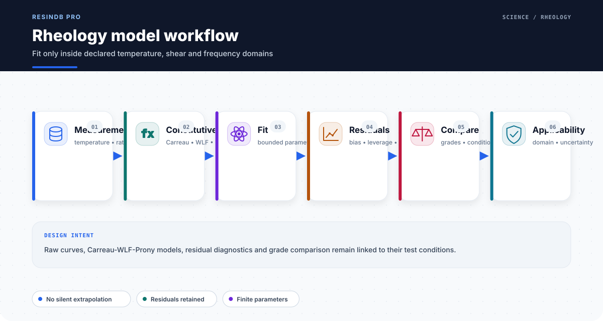
</p>

<p align="center">
  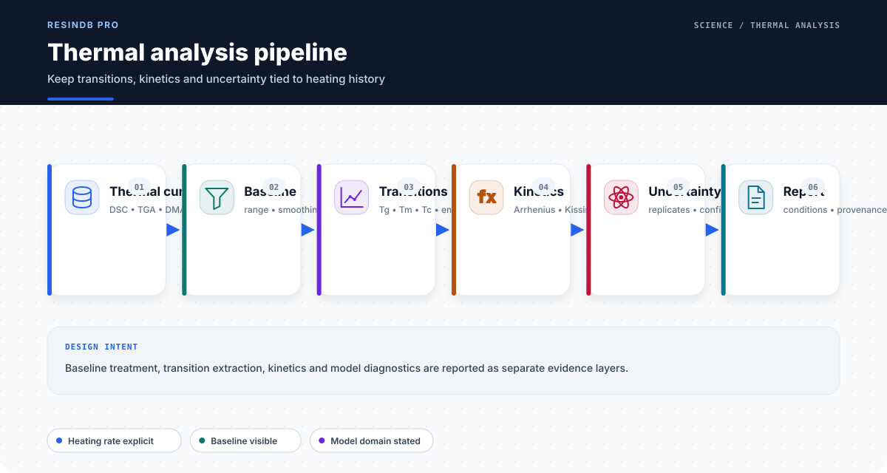
</p>

<p align="center">
  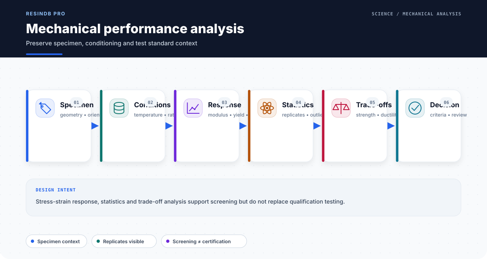
</p>

<p align="center">
  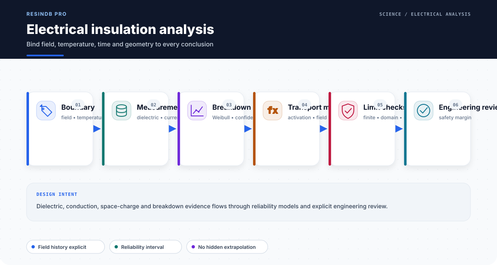
</p>

所有比较必须先确认单位、试验条件和适用范围。模型输出不自动替代标准试验，外推默认不被当作实测事实。

## 多尺度模拟与 AI 材料研发

<p align="center">
  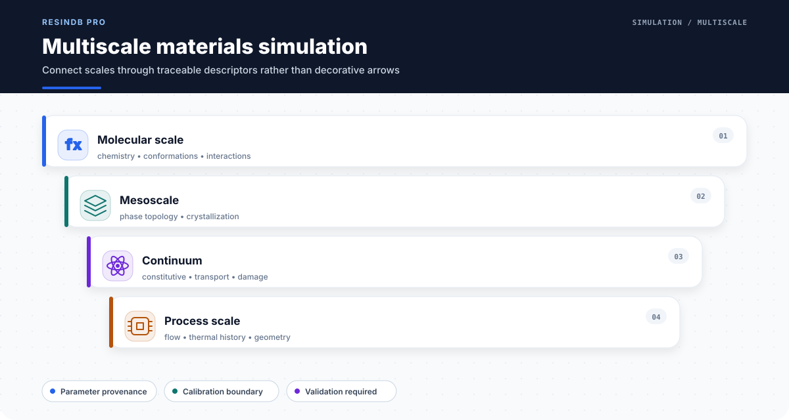
</p>

<p align="center">
  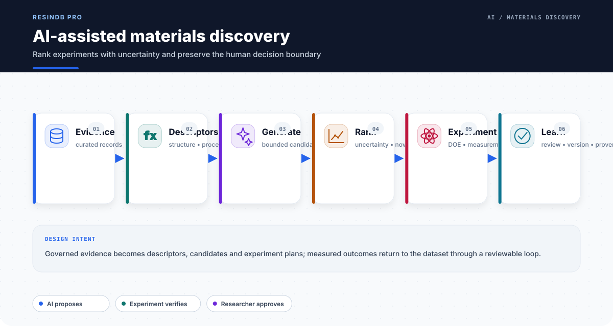
</p>

<p align="center">
  
</p>

AI 能力默认关闭，平台不内置强制供应商。推荐闭环是：定义问题与约束 → 选择证据 → 确定性计算 → AI 辅助解释或候选整理 → 不确定度与反证检查 → 实验验证 → 人工批准。

## 树脂知识网络和决策支持

<p align="center">
  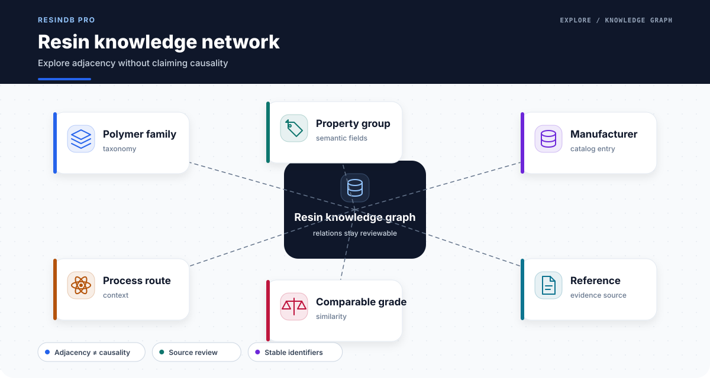
</p>

<p align="center">
  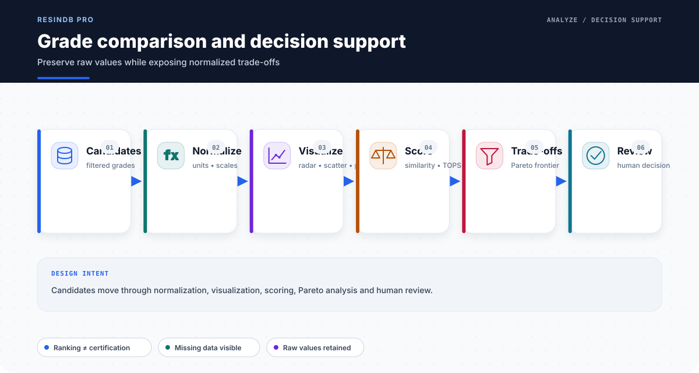
</p>

关系网络支持节点点击和详情反馈，但邻接关系不等于机理证据。比较模块保留原始值和缺失状态，同时提供归一化图表和多指标探索工具。

## 本地优先、数据交换和部署边界

<p align="center">
  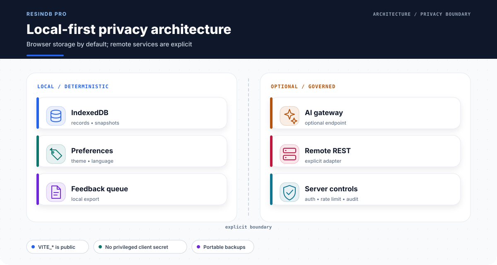
</p>

<p align="center">
  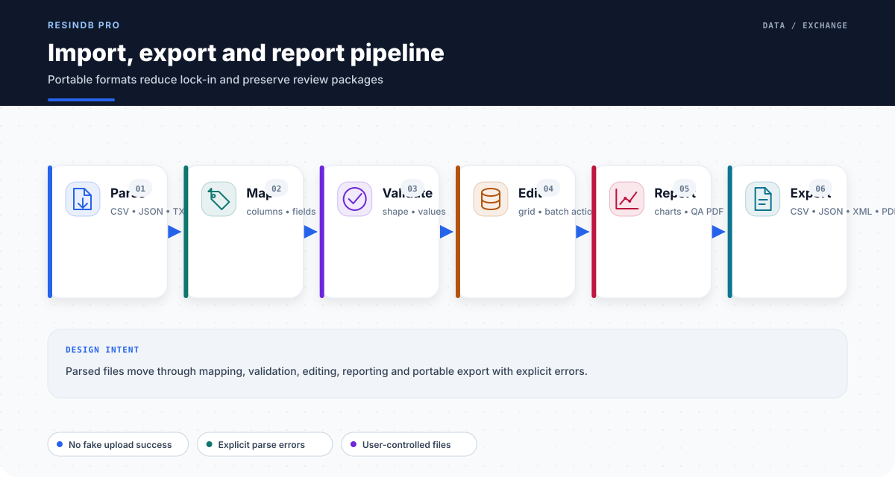
</p>

<p align="center">
  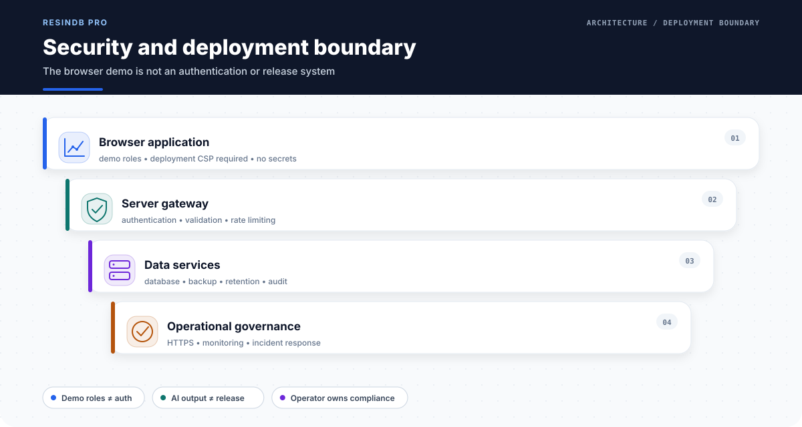
</p>

默认数据保存在当前浏览器 IndexedDB。所有 `VITE_*` 环境变量都会进入前端构建；生产密钥必须位于具备认证、授权、限流和审计的服务端网关。更多说明见 [`SECURITY.md`](SECURITY.md)。

## 科研工作流和质量门

<p align="center">
  
</p>

<p align="center">
  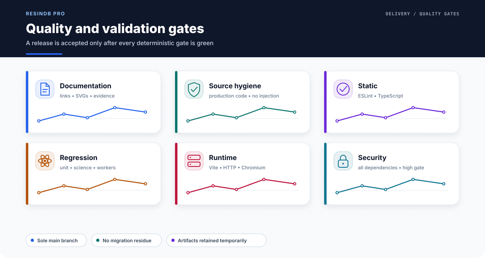
</p>

完整质量门包括：数据 manifest 可复现、Schema 和语义校验、视觉资产确定性、源码卫生、ESLint、TypeScript、完整回归、科学 Worker、覆盖率、生产构建、外置数据哨兵、HTTP smoke、Chromium UI smoke 和全依赖高危审计。

## 快速开始

### 环境要求

- Node.js **22 LTS**
- npm **10+**
- Chromium-compatible browser（仅用于 UI smoke；PDF 报告由 Node.js 生成）

```bash
git clone https://github.com/SUNHAOJUN22/ResinDB-Pro-by-SunHJ.git
cd ResinDB-Pro-by-SunHJ
npm ci
npm run dev
```

默认开发地址为 `http://127.0.0.1:3000`。

### 环境配置

```bash
cp .env.example .env.local
```

| 变量 | 说明 |
|---|---|
| `VITE_BASE_PATH` | 部署子路径；默认 `/` |
| `VITE_AI_API_ENDPOINT` | 完整 OpenAI-compatible chat-completions endpoint |
| `VITE_AI_MODEL` | 服务端模型标识 |
| `VITE_AI_API_KEY` | 仅限受限本地开发 token |
| `VITE_DATABASE_ADAPTER_TYPE` | `indexeddb` 或 `remote_api` |
| `VITE_REMOTE_API_BASE_URL` | 远程 REST 基础路径 |

远程写入失败不会静默回退到 IndexedDB，以免浏览器和服务器形成分叉数据库。

## 开发与数据贡献

```bash
npm run data:manifest       # 重新计算全部数据资产 SHA-256
npm run validate:data       # Schema/引用/ID/环路/哈希校验
npm run visuals:bundle      # 有意修改 SVG 后刷新确定性资产包
npm run visuals:generate    # 从资产包恢复 22 张科研功能 SVG
npm run visuals:check       # 字节级确定性复核
```

新增实测或导入记录时必须明确来源、单位、测试方法、条件、记录状态和复核状态。不得把 demo 数据改名后冒充厂家规格或实测结果。

## 自动测试

```bash
npm ci
npm run validate:docs
npm run validate:source
npm run validate:data
npm run lint
npm run typecheck
npm run test
npm run test:unit
npm run test:science
npm run test:coverage
npm run build
npm run smoke
npm run test:ui
npm run audit:all
```

一键完整验证：

```bash
npm run validate:ci
```

CI 还会证明远程分支仅为 `main`，上传 Coverage、真实 Chromium PNG、HTML Dashboard、PDF 图像报告和机器可读验证收据。详细验收合同见 [`docs/VALIDATION.md`](docs/VALIDATION.md)。

## AI 生成科研图像体系

README 中 **22 张**科研功能图由 `scripts/generate-readme-visuals.mjs` 从经过 SHA-256 固化的 Node.js 视觉资产包确定性恢复并纳入 CI。它们使用同一 SVG 线性图标、8-point 间距、可访问标题/描述、语义色和科研软件信息层级。图像集中保存在 `docs/images/`，不散落在源码或仓库根目录。

完整视觉合同见 [`docs/README_VISUAL_DESIGN_SYSTEM.md`](docs/README_VISUAL_DESIGN_SYSTEM.md)。这些图是架构和科学流程示意，不冒充真实实验显微图或运行截图；真实 UI 截图由 Chromium 自动化生成。

## 项目结构

```text
.
├── .github/workflows/ci.yml
├── data/                         # 唯一权威树脂数据源
├── docs/
│   ├── DATA_ARCHITECTURE.md
│   ├── README_VISUAL_DESIGN_SYSTEM.md
│   ├── VALIDATION.md
│   └── images/                   # 22 张确定性科研 SVG
├── scripts/                      # 数据、视觉、测试、指标和报告工具
├── src/
│   ├── components/
│   ├── contexts/
│   ├── data/resinData.ts         # 运行时 loader；不含 JSON 目录
│   ├── hooks/
│   ├── lib/
│   ├── services/
│   └── workers/
├── tests/
│   ├── science/
│   └── unit/
├── FINAL_CODE_AUDIT.md
├── package.json
└── vite.config.ts
```

## Roadmap

- 服务端身份、RBAC、审计日志和受控数据发布工作流。
- 仪器数据连接、单位本体和标准方法模板。
- 更大规模目录的分页 API、索引和增量缓存。
- 模型适用域、参数溯源和不确定度可视化增强。
- 可签名、可归档的科研证据包和组织级质量流程。

## 分支与发布策略

唯一长期维护分支为 **`main`**。CI 在 `main` push 时拒绝存在额外远程分支。正式发布只有在当前候选树的全部门禁真实通过后才可标记为成功；历史组合证据不能替代新鲜的最终树验证。
