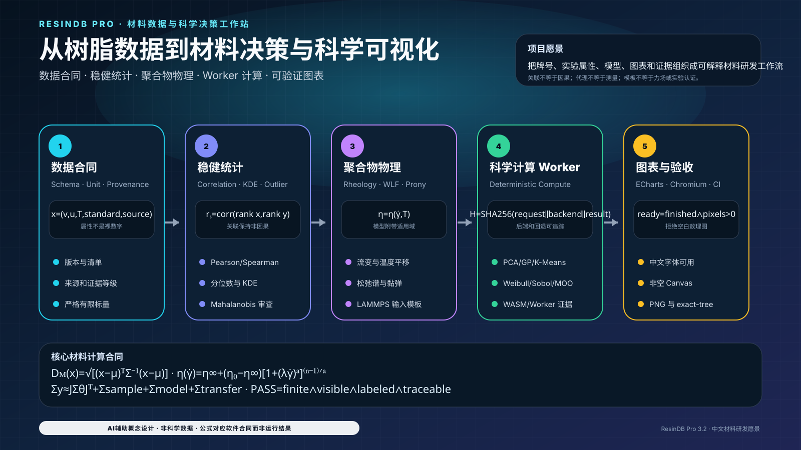

# ResinDB Pro by SunHJ — 中文设计版

[English design edition](README.en.md) · [双语完整技术文档](README.md)

<!-- LOCALIZED_VISION_ZH:START -->
## 中文项目愿景图：从树脂数据到材料决策与科学可视化

<p align="center">
  
</p>

> 图中每个模块和公式对应当前数据、计算、Worker、ECharts 与验收代码；图本身不是树脂实验数据、牌号认证或力场验证结果。

<!-- LOCALIZED_VISION_ZH:END -->

## 平台定位

ResinDB Pro 把树脂牌号、实验/参考属性、统计模型、科学计算 Worker、聚合物物理模板和可重复验收放进同一条证据链。它不是经认证的 LIMS、ERP、材料放行系统或已验证力场平台。

## 数理核心

多变量异常度使用 Mahalanobis 距离：

$$
D_M(\mathbf{x})=
\sqrt{(\mathbf{x}-\boldsymbol{\mu})^{\mathsf T}
\boldsymbol{\Sigma}^{-1}
(\mathbf{x}-\boldsymbol{\mu})}.
$$

非牛顿流变代理采用 Carreau–Yasuda 形式：

$$
\eta(\dot\gamma)=
\eta_\infty+
(\eta_0-\eta_\infty)
\left[1+(\lambda\dot\gamma)^a\right]^{(n-1)/a}.
$$

决策观测量的不确定度预算保持参数、采样、模型和尺度迁移项分离：

$$
\boldsymbol{\Sigma}_y
\approx
\mathbf{J}\boldsymbol{\Sigma}_\theta\mathbf{J}^{\mathsf T}
+
\boldsymbol{\Sigma}_{\mathrm{sample}}
+
\boldsymbol{\Sigma}_{\mathrm{model}}
+
\boldsymbol{\Sigma}_{\mathrm{transfer}}.
$$

科学图表只有在数值有限、语义标签完整、ECharts 完成绘制且 Canvas 非空时才进入验收：

$$
C_{\mathrm{figure}}
=
C_{\mathrm{finite}}
\land C_{\mathrm{labeled}}
\land C_{\mathrm{finished}}
\land C_{\mathrm{nonblank}}.
$$

## 使用策略

1. 先校验数据 Schema、单位、标准、温度、来源和证据等级。
2. 只对有限且量纲一致的数据执行统计、拟合和材料筛选。
3. 区分观测值、拟合值、代理量和情景预测，统计关联不得升级为因果结论。
4. 聚合物或 LAMMPS 模板必须经外部力场、平衡态和实验验证后才能形成科学结论。
5. 中文界面与科研图表必须通过 CJK 字体、ECharts `finished` 事件、非空 Canvas 和 PNG 证据门。
6. README、SVG 和翻译资源统一接受 UTF-8、Unicode、控制字符、CJK 字体和本地图片路径审计。

## 验收

```bash
npm ci
npm run validate:docs
npm run validate:i18n-visuals
npm run validate:scientific-ui
npm run typecheck
npm run test:unit
npm run build
npm run test:ui
```

软件验收只覆盖数据合同、计算实现、界面显示和可重复证据；牌号放行、实验真实性、力场适用性和工业决策仍需独立资格证据。
