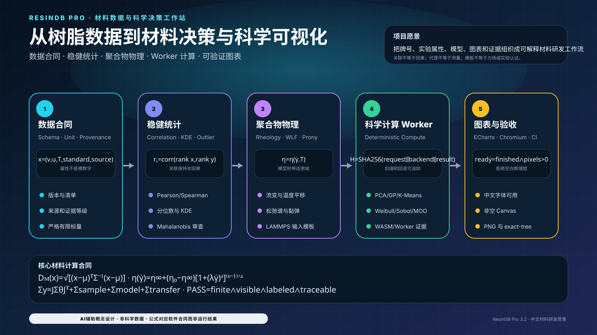

# ResinDB Pro by SunHJ — 中文设计版

[English design edition](README.en.md) · [双语完整技术文档](README.md)


<!-- CLOSURE_STATUS_START -->
## 当前代码资格与使用边界

- `CI` 是完整软件门；`contracts-v17` 只补充 Linux/Windows 跨平台筛查回归。
- 已删除重复的 exact-tree、V19 自定义状态和第二套 full-qualification 工作流；主 CI 本身生成 exact-tree 证据。
- Spearman 相关矩阵使用统一有限数解析与完整案例筛选；缺失、空白、布尔、格式错误及非有限值保持为“未观测”，不再静默改写为物理零。
- 浏览器 AI 仅可调用同源 `/api/ai/proxy`，不保存供应商密钥，并默认拒绝牌号、厂商、配方和自由文本出站。
- 软件通过不代表服务器代理已部署，也不代表密钥托管、隐私/法务、材料放行、法规合规或实验真实性已经获批。
<!-- CLOSURE_STATUS_END -->

<!-- LOCALIZED_VISION_ZH:START -->
## 中文项目愿景图：从树脂数据到材料决策与科学可视化

<p align="center">
  
</p>

> 图中每个模块和公式对应当前数据、计算、Worker、ECharts 与验收代码；图本身不是树脂实验数据、牌号认证或力场验证结果。

<!-- LOCALIZED_VISION_ZH:END -->

## 平台定位

ResinDB Pro 把树脂牌号、实验/参考属性、统计模型、科学计算 Worker、聚合物物理模板和可重复验收放进同一条证据链。它不是经认证的 LIMS、ERP、材料放行系统或已验证力场平台。

## 数理核心

多变量异常度使用 Mahalanobis 距离：

$$
D_M(\mathbf{x})=
\sqrt{(\mathbf{x}-\boldsymbol{\mu})^{\mathsf T}
\boldsymbol{\Sigma}^{-1}
(\mathbf{x}-\boldsymbol{\mu})}.
$$

非牛顿流变代理采用 Carreau–Yasuda 形式：

$$
\eta(\dot\gamma)=
\eta_\infty+
(\eta_0-\eta_\infty)
\left[1+(\lambda\dot\gamma)^a\right]^{(n-1)/a}.
$$

决策观测量的不确定度预算保持参数、采样、模型和尺度迁移项分离：

$$
\boldsymbol{\Sigma}_y
\approx
\mathbf{J}\boldsymbol{\Sigma}_\theta\mathbf{J}^{\mathsf T}
+
\boldsymbol{\Sigma}_{\mathrm{sample}}
+
\boldsymbol{\Sigma}_{\mathrm{model}}
+
\boldsymbol{\Sigma}_{\mathrm{transfer}}.
$$

科学图表只有在数值有限、语义标签完整、ECharts 完成绘制且 Canvas 非空时才进入验收：

$$
C_{\mathrm{figure}}
=
C_{\mathrm{finite}}
\land C_{\mathrm{labeled}}
\land C_{\mathrm{finished}}
\land C_{\mathrm{nonblank}}.
$$

以上分项直接相加，以及概念图中的平方和预算，要求各项已映射到同一观测量、采用一致单位且互不相关。相关输入应保留交叉协方差；一般的一阶传播为 $u_y^2\approx\sum_{i,j}J_iJ_j\operatorname{Cov}(x_i,x_j)$。这些预算公式说明建模条件，不宣称软件已经验证任意材料系统的不确定度。

## 相似度与雷达图：已实现的数值合同

对应实现为 `src/services/mathUtils.ts`，永久回归位于 `tests/unit/mathUtils.test.ts`。先统一单位，再解析完整十进制或科学计数法；空字符串、布尔值、部分数字字符串、NaN 和无穷均不作为观测值。

对有限特征的最小值 $a$、最大值 $b$，常规归一化为 $z=(x-a)/(b-a)$。有限的异号端点仍可能使浮点差值 $b-a$ 溢出；此时先取 $s=\max(|a|,|b|)$，采用等价形式：

$$
z=\frac{x/s-a/s}{b/s-a/s}.
$$

结果限制在 $[0,1]$。现有常量特征判据保持不变：数值范围必须大于 $32\epsilon\max(1,|a|,|b|)$，并至少存在两个有限观测；这个阈值是软件的数值筛选规则，不是测量仪器分辨率。

令 $q$ 为目标的可比较有效特征数，$m$ 为候选与目标的共同有效特征数。候选必须满足 $m\ge2$，评分为：

$$
S=\operatorname{round}\left[
100\frac{m}{q}\max\left(0,1-
\sqrt{\frac{1}{m}\sum_{j=1}^{m}(z_{tj}-z_{pj})^2}
\right)\right].
$$

缺失维度通过 $m/q$ 降低可信覆盖度，不填充为零。雷达图使用同一组全局范围，显示 $100z$，且只保留所有选中牌号都有有限值的维度。

欧氏距离以逐项 `Math.hypot` 累积，避免直接平方把可表示的距离变成无穷或零。若真实距离本身超过浮点表示范围，调用方仍须拒绝非有限结果进入图形。特征统计使用无原型字典，`__proto__`、`constructor` 和 `toString` 不再与对象继承属性混淆。

定向复现命令（先安装锁定依赖）：

```bash
npm ci
npx vitest run tests/unit/mathUtils.test.ts --pool=forks --maxWorkers=1
npm run validate:unicode
npm run validate:scientific-ui
```

回归覆盖大数、极小数、601 个数量级、极大异号范围、保留属性名、普通覆盖度评分和雷达坐标。定向回归通过不等于完整 CI、浏览器视觉验收或六小时耐久测试通过。

## 使用策略

1. 先校验数据 Schema、单位、标准、温度、来源和证据等级。
2. 只对有限且量纲一致的数据执行统计、拟合和材料筛选。
3. 区分观测值、拟合值、代理量和情景预测，统计关联不得升级为因果结论。
4. 聚合物或 LAMMPS 模板必须经外部力场、平衡态和实验验证后才能形成科学结论。
5. 中文界面与科研图表必须通过 CJK 字体、ECharts `finished` 事件、非空 Canvas 和 PNG 证据门。
6. README、SVG 和翻译资源统一接受 UTF-8、Unicode、控制字符、CJK 字体和本地图片路径审计。

## 验收

```bash
npm ci
npm run validate:docs
npm run validate:i18n-visuals
npm run validate:scientific-ui
npm run typecheck
npm run test:unit
npm run build
npm run test:ui
```

软件验收只覆盖数据合同、计算实现、界面显示和可重复证据；牌号放行、实验真实性、力场适用性和工业决策仍需独立资格证据。

<!-- CURRENT_MAIN_ACCEPTANCE_V2:START -->
## 当前 `main`：数据—计算—图形—证据闭环

<p align="center"></p>

> 该图由当前代码合同生成，是科学软件概念设计，不是树脂数据库测量结果。

### 核心数理合同

$$
C_figure = C_finite ∧ C_labeled ∧ C_finished ∧ C_nonblank
$$

$$
d_M(x, μ) = √((x − μ)ᵀ Σ⁻¹ (x − μ))
$$

$$
u_c² = u_data² + u_model² + u_scale²
$$

### 使用策略

1. 导入时先验证 Schema、来源类型、记录状态、单位和有限值。
2. 相似度、回归、聚类与 UQ 必须显式处理缺失数据、尺度和适用域。
3. 浏览器图形只有在 ECharts finished、Canvas 非空且标签完整时才可导出。
4. 中文与英文 README、SVG 和界面字符串分别验收，禁止语言串扰和乱码。

> **责任边界：** ResinDB Pro 是本地优先的科学数据与分析工作台，不是经认证的 LIMS/ERP、商业力场、工业牌号放行系统或自动科研批准器。

执行提示词: [SIX_REPOSITORY_PARALLEL_6H_ACCEPTANCE_PROMPT_V2.md](docs/SIX_REPOSITORY_PARALLEL_6H_ACCEPTANCE_PROMPT_V2.md)
<!-- CURRENT_MAIN_ACCEPTANCE_V2:END -->
